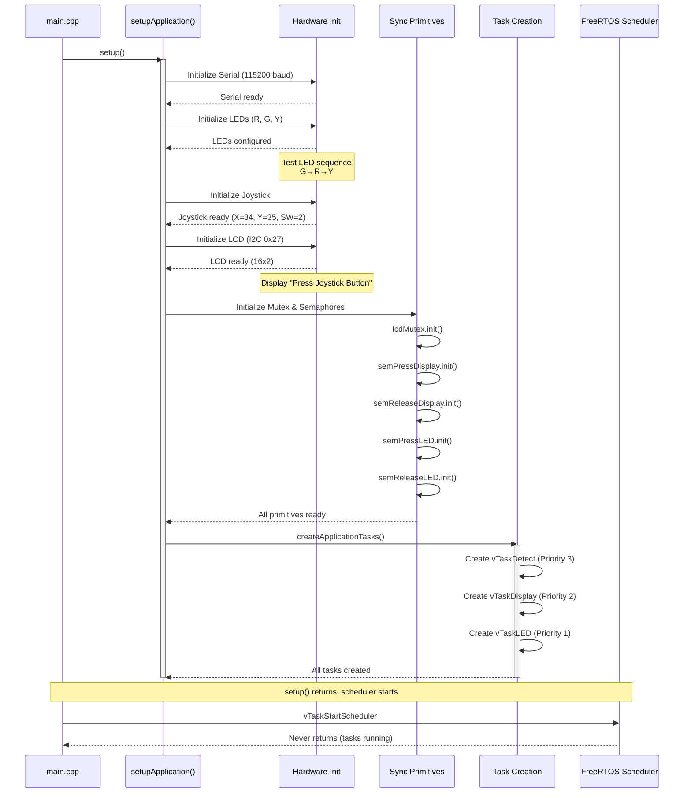
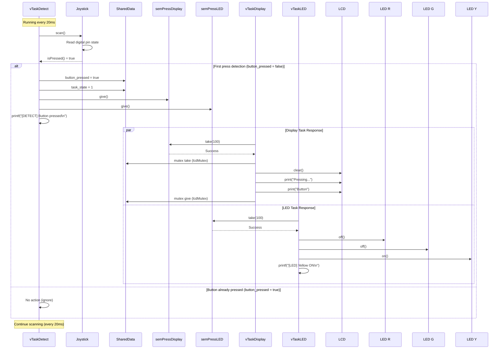
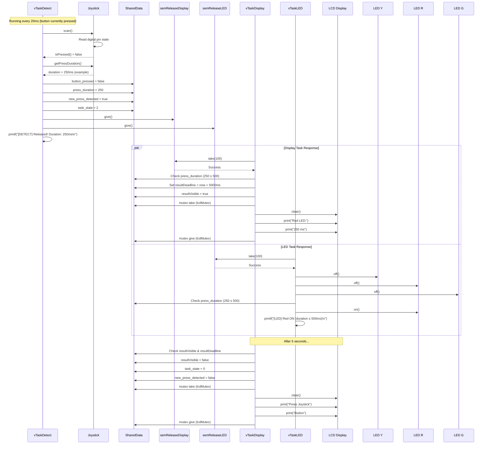
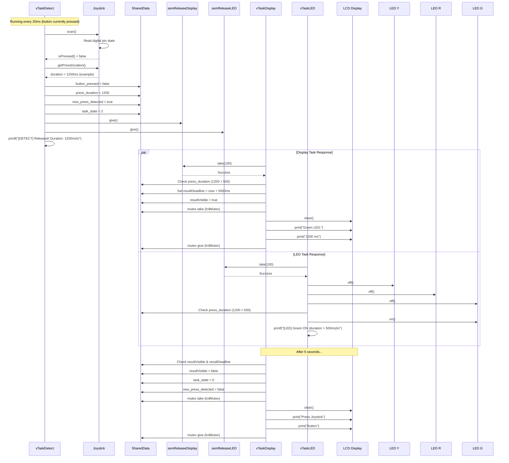
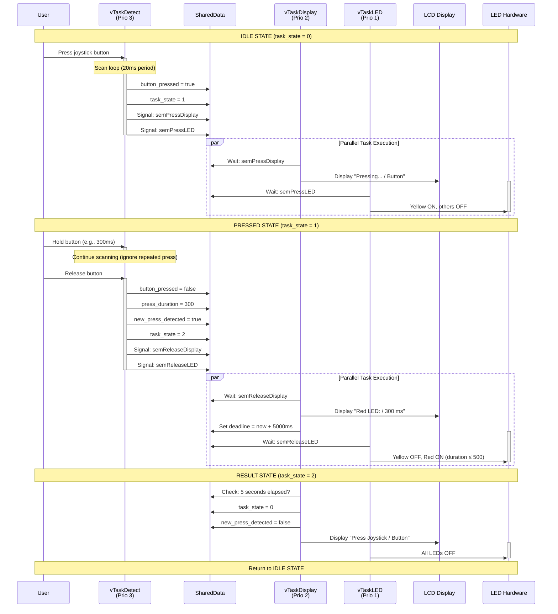
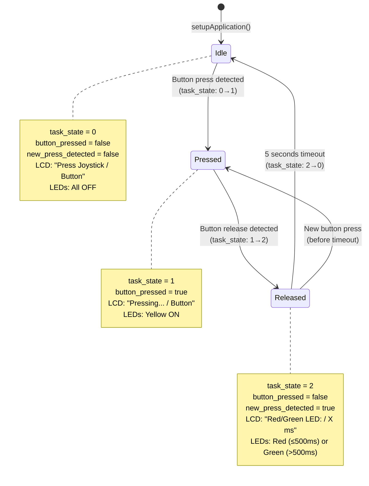

# Lab 2.2 - FreeRTOS Joystick & LED Control System

## Table of Contents
1. [Overview](#overview)
2. [Architecture](#architecture)
3. [System Components](#system-components)
4. [Hardware Configuration](#hardware-configuration)
5. [Software Architecture](#software-architecture)
6. [FreeRTOS Task Design](#freertos-task-design)
7. [Sequence Diagrams](#sequence-diagrams)
8. [State Machine](#state-machine)
9. [Synchronization Mechanisms](#synchronization-mechanisms)
10. [Implementation Details](#implementation-details)

---

## Overview

This project implements a multi-task real-time system using FreeRTOS on ESP32 platform. The system monitors a joystick button press, measures its duration, and provides visual feedback through LEDs and an LCD display based on the press duration.

### Key Features
- **Real-time button detection** with precise timing measurement
- **Multi-task architecture** using FreeRTOS with three concurrent tasks
- **Synchronized communication** between tasks using semaphores
- **Thread-safe LCD updates** using mutex protection
- **State-based LED control** with different behaviors for short vs long presses

---

## Architecture

### High-Level Architecture

```
┌─────────────────────────────────────────────────────────────┐
│                     ESP32 (Arduino Framework)                │
│                                                               │
│  ┌─────────────────────────────────────────────────────┐   │
│  │              FreeRTOS Kernel                         │   │
│  │                                                       │   │
│  │  ┌────────────┐  ┌────────────┐  ┌────────────┐     │   │
│  │  │ vTaskDetect│  │vTaskDisplay│  │ vTaskLED   │     │   │
│  │  │  (Priority │  │ (Priority  │  │ (Priority  │     │   │
│  │  │    3)      │  │    2)      │  │    1)      │     │   │
│  │  └──────┬─────┘  └─────┬──────┘  └─────┬──────┘     │   │
│  └─────────┼───────────────┼───────────────┼───────────┘   │
│            │               │               │               │
│            ▼               ▼               ▼               │
│  ┌─────────────────────────────────────────────────────┐   │
│  │           Shared Data & Synchronization              │   │
│  │  ┌──────────┐  ┌──────────────┐  ┌──────────────┐   │   │
│  │  │  Mutex   │  │ Binary Sems  │  │ SharedData   │   │   │
│  │  │ (LCD)    │  │ (Press/Rel)  │  │ Struct       │   │   │
│  │  └──────────┘  └──────────────┘  └──────────────┘   │   │
│  └─────────────────────────────────────────────────────┘   │
│                                                               │
│  ┌─────────────────────────────────────────────────────┐   │
│  │              Hardware Abstraction Layer              │   │
│  │  ┌──────────┐  ┌──────────┐  ┌──────────────┐     │   │
│  │  │ Joystick │  │   LED    │  │ LCD (I2C)    │     │   │
│  │  └──────────┘  └──────────┘  └──────────────┘     │   │
│  └─────────────────────────────────────────────────────┘   │
└─────────────────────────────────────────────────────────────┘
```

---

## System Components

### 1. FreeRTOS Tasks (src/modules/freertos_app/tasks/)

#### vTaskDetect - Button Detection Task
- **Priority**: 3 (Highest)
- **Purpose**: Continuously scan joystick button state and detect press/release events
- **Frequency**: Every 20ms (using `delayUntil` for precise timing)
- **Responsibilities**:
  - Monitor joystick button state
  - Detect button press (transition from released to pressed)
  - Detect button release (transition from pressed to released)
  - Measure press duration
  - Signal other tasks via semaphores

#### vTaskDisplay - Display Update Task
- **Priority**: 2 (Medium)
- **Purpose**: Update LCD display based on button events
- **Frequency**: Every 50ms (main loop)
- **Responsibilities**:
  - Wait for press/release semaphore signals
  - Update LCD with appropriate messages
  - Display press duration after release
  - Return to idle message after 5 seconds

#### vTaskLED - LED Control Task
- **Priority**: 1 (Lowest)
- **Purpose**: Control LED states based on system state
- **Frequency**: Every 50ms (main loop)
- **Responsibilities**:
  - Turn on yellow LED on button press
  - Turn on red or green LED on button release
  - Turn off all LEDs in idle state
  - Color selection based on press duration (>500ms = green, ≤500ms = red)

### 2. Hardware Modules (src/modules/)

#### Joystick Module (joystick/)
- **Class**: `Joystick`
- **Functionality**:
  - Read analog X/Y positions (Pins A0, A1)
  - Detect button press on digital pin
  - Calculate press duration
  - Debounce button input
- **API Methods**:
  - `scan()` - Update button state
  - `isPressed()` - Current press state
  - `getPressDuration()` - Duration of press in milliseconds

#### LED Module (led/)
- **Class**: `Led`
- **Functionality**:
  - Digital output control for LEDs
  - State management (on/off)
  - Toggle capability
- **API Methods**:
  - `on()` - Turn LED on
  - `off()` - Turn LED off
  - `toggle()` - Switch LED state

#### LCD Module (lcd/)
- **Class**: `LcdI2c`
- **Functionality**:
  - I2C LCD communication (address 0x27)
  - 16x2 character display
  - Printf-style output support
- **API Methods**:
  - `print()` - Print text
  - `clear()` - Clear display
  - `setCursor()` - Position cursor

### 3. Kernel Primitives (src/modules/kernel_primitives/)

#### Mutex (mutex/)
- **Purpose**: Mutual exclusion for shared resources
- **Usage**: Protect LCD I2C communication from concurrent access
- **Implementation**: Wrapper around FreeRTOS `xSemaphoreCreateMutex()`

#### Binary Semaphore (semaphore/)
- **Purpose**: Event signaling between tasks
- **Usage**: Four semaphores for inter-task communication
- **Implementation**: Wrapper around FreeRTOS `xSemaphoreCreateBinary()`

---

## Hardware Configuration

### Pin Assignments

| Component | Pin | Type | Description |
|-----------|-----|------|-------------|
| Joystick X | 34 (A0) | Analog Input | X-axis position |
| Joystick Y | 35 (A1) | Analog Input | Y-axis position |
| Joystick SW | 2 (D3) | Digital Input | Button press (active LOW) |
| LED Red | 12 | Digital Output | Red LED control |
| LED Green | 14 | Digital Output | Green LED control |
| LED Yellow | 13 | Digital Output | Yellow LED control |
| LCD SDA | 21 | I2C Data | I2C communication |
| LCD SCL | 22 | I2C Clock | I2C communication |

### Hardware Setup

```
                    ESP32 DevKit V1
    ┌─────────────────────────────────────┐
    │                                     │
    │  [34] ──────── Joystick X (A0)      │
    │  [35] ──────── Joystick Y (A1)      │
    │  [2]  ──────── Joystick Button      │
    │                                     │
    │  [12] ──────── LED Red ──[220Ω]─ GND│
    │  [14] ──────── LED Green─[220Ω]─ GND│
    │  [13] ──────── LED Yellow[220Ω]─ GND│
    │                                     │
    │  [21] (SDA) ──────────────────────┐ │
    │  [22] (SCL) ──────────────┐       │ │
    │                           │       │ │
    │                    LCD I2C │       │ │
    │                    (0x27)  │       │ │
    │                           │       │ │
    │                    ┌──────┴───────┴┐│
    │                    │ 16x2 LCD      ││
    │                    └───────────────┘│
    └─────────────────────────────────────┘
```

---

## Software Architecture

### Module Organization

```
src/
├── main.cpp                          # Entry point
└── modules/
    ├── freertos_app/                 # FreeRTOS application
    │   ├── freertos_app.h/cpp        # Main app interface
    │   ├── init/                     # Initialization
    │   │   ├── init.h/cpp
    │   ├── state/                    # Shared state
    │   │   ├── state.h/cpp
    │   ├── sync/                     # Synchronization
    │   │   ├── sync.h/cpp
    │   └── tasks/                    # Task implementations
    │       ├── tasks.h/cpp
    ├── kernel_primitives/            # FreeRTOS wrappers
    │   ├── task/
    │   │   ├── task.h/cpp
    │   ├── mutex/
    │   │   ├── mutex.h/cpp
    │   └── semaphore/
    │       ├── binary_semaphore.h/cpp
    ├── joystick/                     # Joystick driver
    │   ├── joystick.h/cpp
    ├── led/                          # LED driver
    │   ├── led.h/cpp
    └── lcd/                          # LCD driver
        ├── lcd.h/cpp
```

### Shared Data Structure

```cpp
struct SharedData {
    uint32_t press_duration;        // Duration of button press (ms)
    bool new_press_detected;        // Flag for new press event
    bool button_pressed;            // Current button state
    uint8_t task_state;             // System state (0=idle, 1=pressed, 2=released)
};
```

### Synchronization Primitives

```cpp
// LCD access protection
kernel_primitives::Mutex lcdMutex;

// Inter-task signaling
kernel_primitives::BinarySemaphore semPressDisplay;   // Signal display task on press
kernel_primitives::BinarySemaphore semReleaseDisplay; // Signal display task on release
kernel_primitives::BinarySemaphore semPressLED;       // Signal LED task on press
kernel_primitives::BinarySemaphore semReleaseLED;     // Signal LED task on release
```

---

## FreeRTOS Task Design

### Task Configuration

| Task | Priority | Stack Size | Period | Description |
|------|----------|------------|--------|-------------|
| vTaskDetect | 3 | 4096 bytes | 20ms | Button detection |
| vTaskDisplay | 2 | 4096 bytes | 50ms | Display updates |
| vTaskLED | 1 | 4096 bytes | 50ms | LED control |

### Task Communication Flow

```
┌─────────────────────────────────────────────────────────────────┐
│                      Inter-Task Communication                     │
└─────────────────────────────────────────────────────────────────┘

vTaskDetect (Producer)                    vTaskDisplay (Consumer)
       │                                          │
       │  [1] Button Press Detected               │
       ├──────────────────────────────────────────>│ semPressDisplay.give()
       │                                          │
       │  [2] Button Release Detected             │
       ├──────────────────────────────────────────>│ semReleaseDisplay.give()
       │                                          │

vTaskDetect (Producer)                    vTaskLED (Consumer)
       │                                          │
       │  [3] Button Press Detected               │
       ├──────────────────────────────────────────>│ semPressLED.give()
       │                                          │
       │  [4] Button Release Detected             │
       ├──────────────────────────────────────────>│ semReleaseLED.give()
       │                                          │
```

---

## Sequence Diagrams

### 1. System Initialization Sequence



### 2. Button Press Detection Sequence



### 3. Button Release Detection Sequence (Short Press ≤ 500ms)



### 4. Button Release Detection Sequence (Long Press > 500ms)



### 5. Complete Button Cycle Sequence (Press → Release → Reset)



### 6. Mutex Protection Sequence (LCD Access)

```mermaid
sequenceDiagram
    participant TaskDisplay as vTaskDisplay
    participant Mutex as lcdMutex
    participant LCD as LCD Hardware
    participant TaskOther as Other Task<br/>(hypothetical)

    Note over TaskDisplay,Mutex: Scenario: Display task needs to update LCD
    
    TaskDisplay->>Mutex: take(100ms)
    activate Mutex
    
    alt Mutex available
        Mutex-->>TaskDisplay: Success (locked)
        TaskDisplay->>LCD: clear()
        TaskDisplay->>LCD: print(line1)
        TaskDisplay->>LCD: print(line2)
        TaskDisplay->>Mutex: give()
        Mutex-->>TaskDisplay: Unlocked
        deactivate Mutex
        
        Note over TaskDisplay,LCD: LCD update complete
    else Mutex busy (hypothetical concurrent access)
        TaskOther->>Mutex: take(100ms) [Already taken by TaskDisplay]
        Mutex-->>TaskOther: Timeout or wait
        Note over TaskOther: Waiting for lock...
        
        TaskDisplay->>LCD: clear()
        TaskDisplay->>LCD: print(line1)
        TaskDisplay->>LCD: print(line2)
        TaskDisplay->>Mutex: give()
        Mutex-->>TaskDisplay: Unlocked
        deactivate Mutex
        
        TaskOther->>Mutex: take(100ms)
        Mutex-->>TaskOther: Success (now locked)
        TaskOther->>LCD: clear()
        TaskOther->>LCD: print(other_data)
        TaskOther->>Mutex: give()
        Mutex-->>TaskOther: Unlocked
        deactivate Mutex
    end
```

---

## State Machine

### System State Transitions



### Task State Values

| State Value | Name | Description | LCD Display | LED State |
|-------------|------|-------------|-------------|-----------|
| 0 | IDLE | Waiting for button press | "Press Joystick / Button" | All OFF |
| 1 | PRESSED | Button is currently pressed | "Pressing... / Button" | Yellow ON |
| 2 | RELEASED | Button released, showing result | "Red/Green LED: / X ms" | Red (≤500ms) or Green (>500ms) |

---

## Synchronization Mechanisms

### Binary Semaphores (Event Signaling)

#### semPressDisplay
- **Purpose**: Signal Display task that button was pressed
- **Producer**: vTaskDetect (on button press detection)
- **Consumer**: vTaskDisplay
- **Action**: Triggers display update to "Pressing... / Button"

#### semReleaseDisplay
- **Purpose**: Signal Display task that button was released
- **Producer**: vTaskDetect (on button release detection)
- **Consumer**: vTaskDisplay
- **Action**: Triggers display update with press duration and result message

#### semPressLED
- **Purpose**: Signal LED task that button was pressed
- **Producer**: vTaskDetect (on button press detection)
- **Consumer**: vTaskLED
- **Action**: Triggers yellow LED to turn ON

#### semReleaseLED
- **Purpose**: Signal LED task that button was released
- **Producer**: vTaskDetect (on button release detection)
- **Consumer**: vTaskLED
- **Action**: Triggers appropriate LED (Red or Green) based on duration

### Mutex (Resource Protection)

#### lcdMutex
- **Purpose**: Protect LCD I2C communication from concurrent access
- **Protected Resource**: LCD hardware access
- **Users**: vTaskDisplay only (in this implementation)
- **Protocol**:
  1. Call `lcdMutex.take(100)` before LCD operations
  2. Perform LCD operations (clear, print, setCursor)
  3. Call `lcdMutex.give()` after LCD operations

---

## Implementation Details

### 1. Joystick Module Implementation

#### Key Features
- **Debouncing**: Built-in debouncing in `scan()` method
- **Duration Measurement**: Tracks press start time and calculates duration
- **State Tracking**: Maintains current and previous button states

#### Important Code Patterns

```cpp
// Button press detection (state.cpp:tasks.cpp)
if (joystick->isPressed()) {
    if (!sharedData.button_pressed) {
        sharedData.button_pressed = true;
        sharedData.task_state = 1;
        semPressDisplay.give();
        semPressLED.give();
    }
}

// Button release detection
else {
    if (sharedData.button_pressed) {
        uint32_t duration = joystick->getPressDuration();
        sharedData.button_pressed = false;
        sharedData.press_duration = duration;
        sharedData.new_press_detected = true;
        sharedData.task_state = 2;
        semReleaseDisplay.give();
        semReleaseLED.give();
    }
}
```

### 2. Task Timing Implementation

#### vTaskDetect (Precise Timing)
```cpp
TickType_t xLastWakeTime = xTaskGetTickCount();
for (;;) {
    kernel_primitives::delayUntilMs(&xLastWakeTime, 20);
    // Scan joystick every 20ms (50Hz)
}
```
- Uses `delayUntil` for precise periodic execution
- Ensures consistent 20ms scan rate regardless of execution time

#### vTaskDisplay & vTaskLED (Polling)
```cpp
for (;;) {
    if (semPressDisplay.take(100)) {
        // Handle press event
    }
    if (semReleaseDisplay.take(100)) {
        // Handle release event
    }
    // Check timeout for result display
    if (resultVisible && xTaskGetTickCount() >= resultDeadline) {
        // Reset to idle state
    }
    kernel_primitives::delayMs(50); // 20Hz polling
}
```
- Uses non-blocking semaphore take with timeout
- Allows checking multiple events in single iteration
- 50ms delay between iterations

### 3. Thread-Safe LCD Updates

```cpp
void updateLCD(const char *line1, const char *line2) {
    if (lcd == nullptr) return;
    
    if (lcdMutex.take(100)) {
        lcd->clear();
        kernel_primitives::delayMs(50); // LCD processing time
        lcd->setCursor(0, 0);
        lcd->print(line1);
        kernel_primitives::delayMs(50);
        lcd->setCursor(0, 1);
        lcd->print(line2);
        lcdMutex.give();
    }
}
```
- Mutex protection ensures no concurrent LCD access
- Delays added for LCD processing time
- Null pointer check for safety

### 4. LED Control Logic

```cpp
if (semPressLED.take(100)) {
    if (ledR) ledR->off();
    if (ledG) ledG->off();
    if (ledY) ledY->on(); // Yellow on press
}

if (semReleaseLED.take(100)) {
    if (ledY) ledY->off();
    if (ledR) ledR->off();
    if (ledG) ledG->off();
    
    if (sharedData.press_duration > 500) {
        if (ledG) ledG->on(); // Green for long press
    } else {
        if (ledR) ledR->on(); // Red for short press
    }
}

if (sharedData.task_state == 0) {
    // All LEDs off in idle state
    if (ledR) ledR->off();
    if (ledG) ledG->off();
    if (ledY) ledY->off();
}
```

### 5. FreeRTOS Task Creation

```cpp
bool createApplicationTasks() {
    bool detectCreated = kernel_primitives::createTask(
        vTaskDetect,
        "Detect",
        TASK_STACK_SIZE,
        nullptr,
        TASK_PRIORITY_DETECT,
        nullptr
    );
    
    bool displayCreated = kernel_primitives::createTask(
        vTaskDisplay,
        "Display",
        TASK_STACK_SIZE,
        nullptr,
        TASK_PRIORITY_DISPLAY,
        nullptr
    );
    
    bool ledCreated = kernel_primitives::createTask(
        vTaskLED,
        "LED",
        TASK_STACK_SIZE,
        nullptr,
        TASK_PRIORITY_LED,
        nullptr
    );
    
    return detectCreated && displayCreated && ledCreated;
}
```

---

## Conclusion

This FreeRTOS-based implementation demonstrates:

1. **Real-time multi-tasking**: Three concurrent tasks with different priorities
2. **Precise timing**: 20ms button scanning using `delayUntil`
3. **Event-driven architecture**: Semaphores for inter-task communication
4. **Thread safety**: Mutex protection for shared resources
5. **State management**: Clear state machine for system behavior
6. **Hardware abstraction**: Clean separation between application logic and hardware drivers

The system reliably detects button presses, measures duration with millisecond precision, and provides immediate visual feedback through LEDs and LCD display. The use of FreeRTOS ensures deterministic behavior and proper resource management in a real-time environment.

---

## File Reference

| File | Purpose |
|------|---------|
| `src/main.cpp` | Entry point, calls freertos_app::setup() and loop() |
| `src/modules/freertos_app/freertos_app.cpp` | Main application interface |
| `src/modules/freertos_app/init/init.cpp` | System initialization |
| `src/modules/freertos_app/state/state.cpp` | Shared state and constants |
| `src/modules/freertos_app/sync/sync.cpp` | Synchronization primitives |
| `src/modules/freertos_app/tasks/tasks.cpp` | Task implementations |
| `src/modules/joystick/joystick.cpp` | Joystick driver |
| `src/modules/led/led.cpp` | LED driver |
| `src/modules/lcd/lcd.cpp` | LCD driver |
| `src/modules/kernel_primitives/` | FreeRTOS wrappers |

---

**End of Documentation**