# Sound Detection System - UML Diagrams

## 1. Architecture Diagram

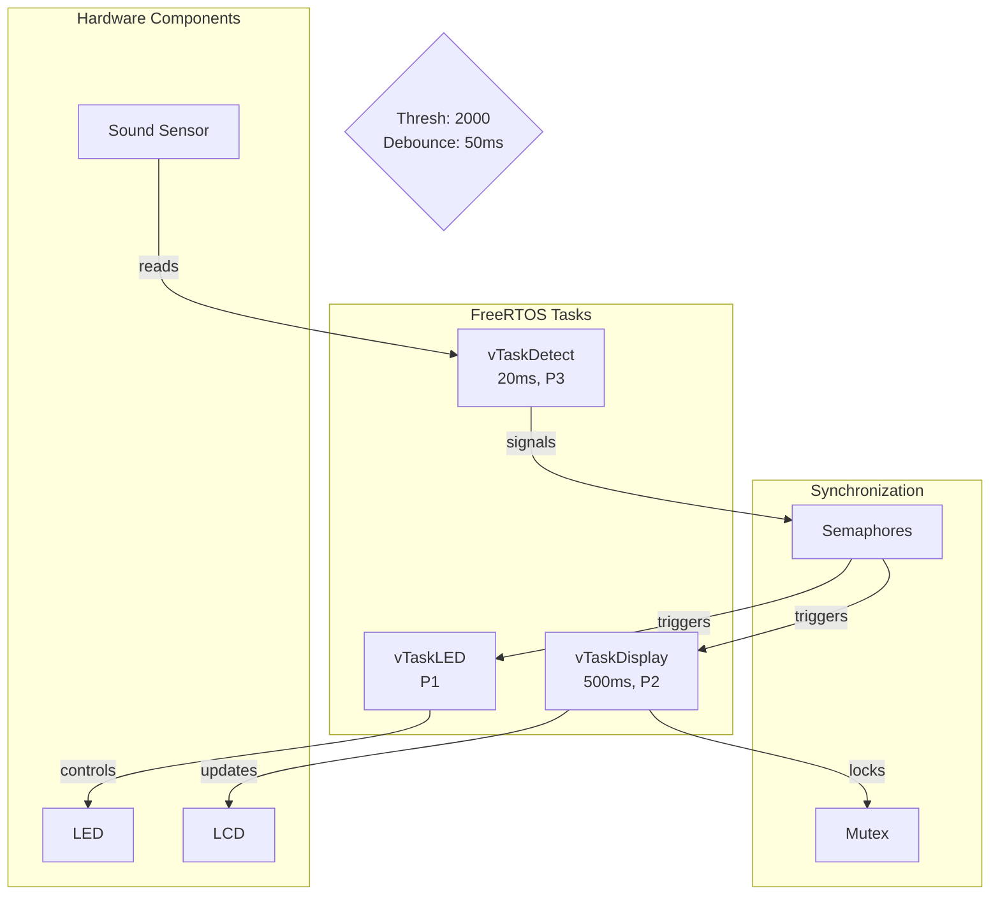

## 2. Component Diagram

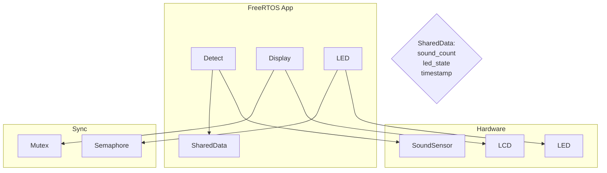

## 3. Class Diagram

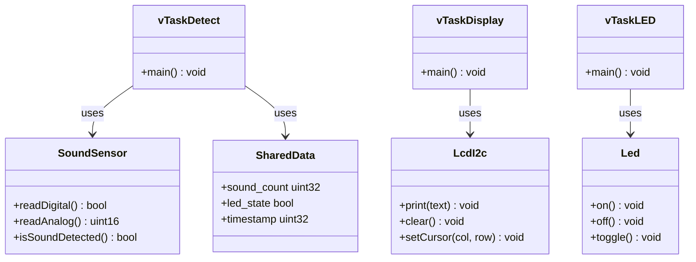

## 4. Detect Activity Diagram

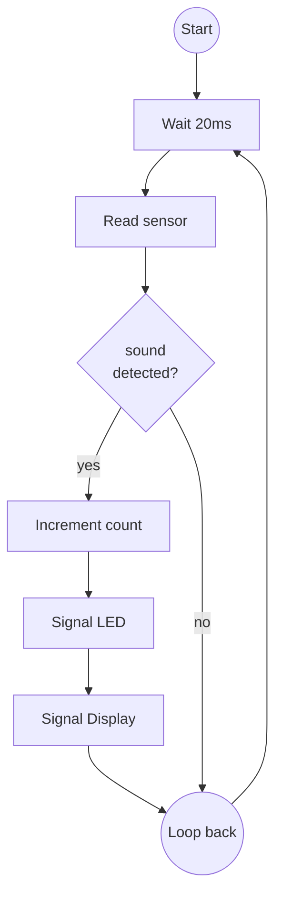

## 5. Display Activity Diagram

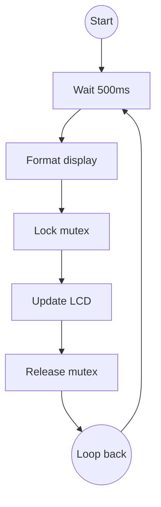

## 6. LED Activity Diagram

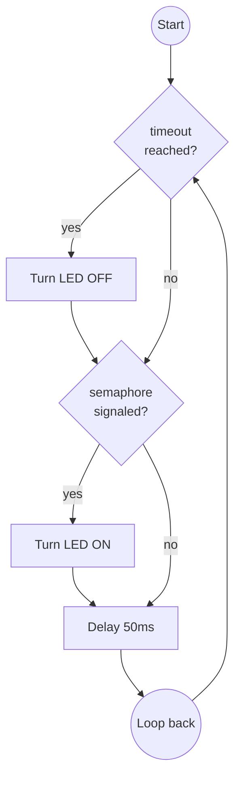

## 7. Data Flow Diagram

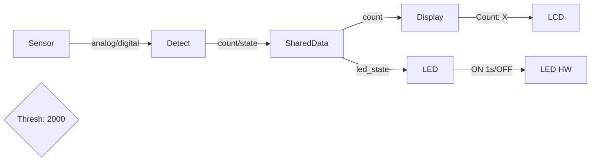

## 8. Software Layers Diagram

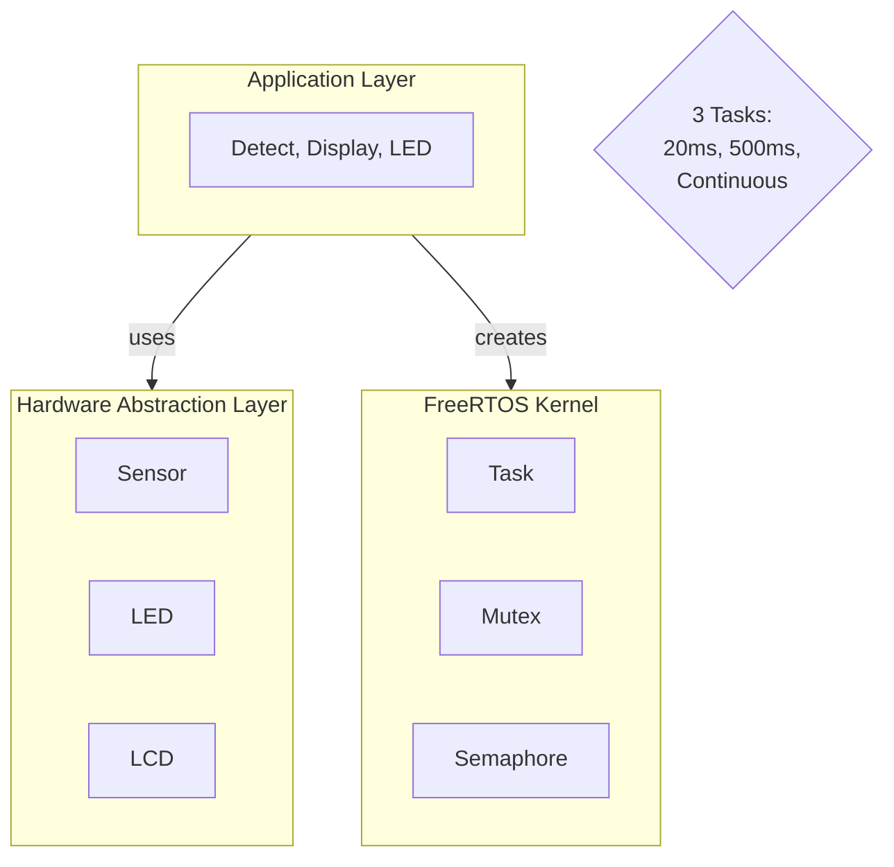

## 9. Detailed Low-Level Architecture

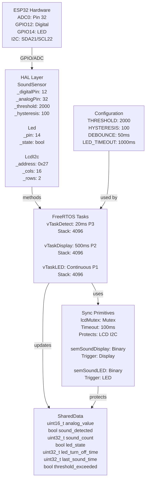

## 10. Sound Sensor Sequence Diagram

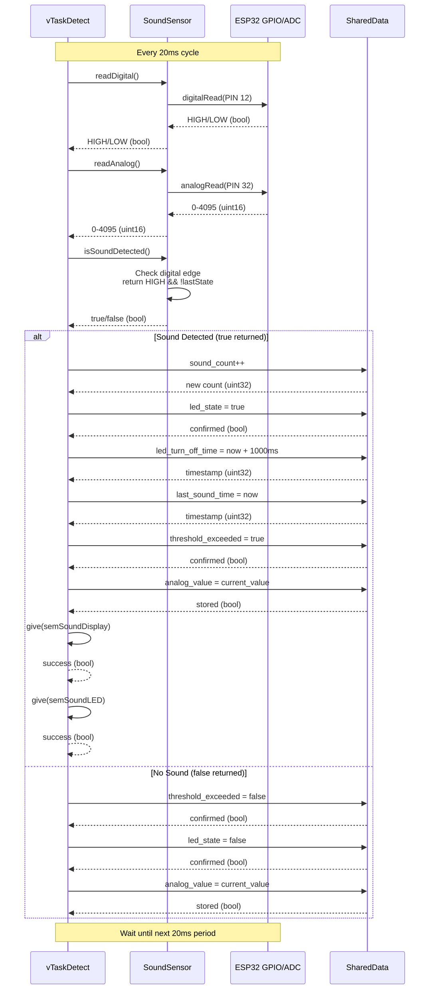

## 11. LCD Sequence Diagram

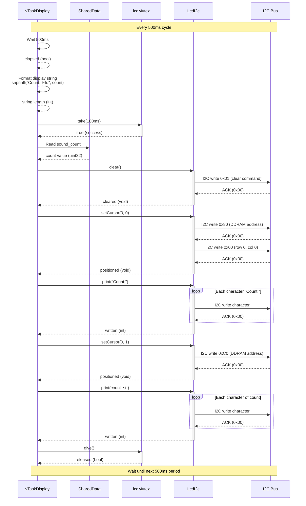

## 12. LED Sequence Diagram

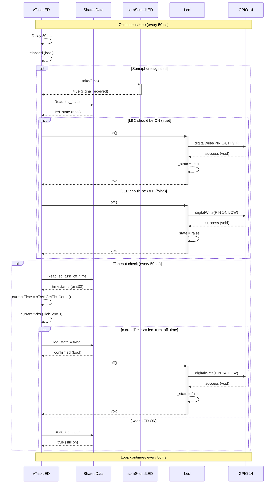

## 13. Data Flow - Input Layer

```mermaid
graph LR
    subgraph Hardware_Input["Hardware Input Layer"]
        ADC[ADC0<br/>Pin: 32<br/>Function: Read analog<br/>Returns: 0-4095<br/>ESP32 ADC1_CH4]
        
        DIG[GPIO 12<br/>Function: Read digital<br/>Returns: HIGH/LOW<br/>Sound Sensor D0]
        
        SOUND[Sound Sensor HW<br/>Function: Detect sound<br/>Output: Digital/Analog<br/>Threshold: Adjustable]
    end

    subgraph HAL_Input["HAL Input Layer"]
        Sensor[SoundSensor<br/>readDigital(): digitalRead 12<br/>readAnalog(): analogRead 32<br/>isSoundDetected(): edge detection<br/>_lastDigitalState: bool<br/>_currentValue: uint16]
    end

    subgraph Task_Input["Task Input Layer"]
        Detect[vTaskDetect<br/>Function: Read sensors<br/>Period: 20ms<br/>Priority: 3<br/>Calls: Sensor methods]
    end

    SOUND -->|analog signal| ADC
    SOUND -->|digital signal| DIG
    
    ADC -->|value 0-4095| Sensor
    DIG -->|HIGH/LOW| Sensor
    
    Sensor -->|bool HIGH/LOW| Detect
    Sensor -->|uint16 0-4095| Detect
    Sensor -->|bool soundDetected| Detect
```

## 14. Data Flow - Processing Layer

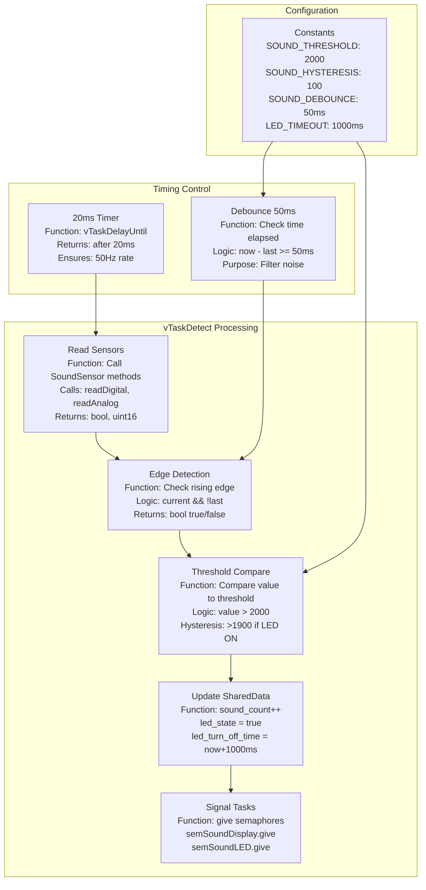

## 15. Data Flow - Storage Layer

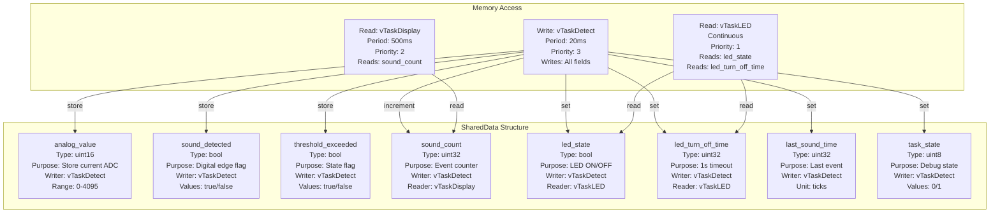

## 16. Data Flow - Display Output

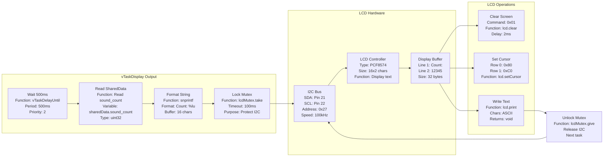

## 17. Data Flow - LED Output

```mermaid
graph LR
    subgraph LED_Task["vTaskLED Output"]
        Trigger[Trigger<br/>semSoundLED<br/>Binary Semaphore<br/>Signal from Detect]
        
        Loop[Loop<br/>Period: 50ms<br/>Priority: 1<br/>Continuous]
        
        CheckState[Check State<br/>Read led_state<br/>Read timestamp<br/>Compare current]
        
        Control[Control GPIO<br/>Pin: 14<br/>Type: Output<br/>Mode: Push-pull]
    end

    subgraph LED_Hardware["LED Hardware"]
        GPIO[GPIO 14<br/>ESP32 GPIO<br/>Direction: OUT<br/>Drive strength: High]
        
        LED_HW[LED HW<br/>Anode: GPIO 14<br/>Cathode: GND<br/>Resistor: 220Ω<br/>Color: Red]
        
        State[LED State<br/>OFF: LOW (0V)<br/>ON: HIGH (3.3V)<br/>Duration: 1000ms]
    end

    subgraph LED_Logic["LED Logic"]
        TurnON[Turn ON<br/>digitalWrite 14 HIGH<br/>Set led_state=true<br/>Start timeout]
        
        TurnOFF[Turn OFF<br/>digitalWrite 14 LOW<br/>Set led_state=false<br/>Clear timeout]
        
        Timeout[Timeout Check<br/>led_turn_off_time<br/>Current time<br/>Compare: >=]
    end

    Trigger --> Loop
    Loop --> CheckState
    CheckState --> Control
    
    Control --> GPIO
    GPIO --> LED_HW
    LED_HW --> State
    
    State -->|signal received| TurnON
    TurnON --> GPIO
    
    State -->|timeout reached| Timeout
    Timeout --> TurnOFF
    TurnOFF --> GPIO
    
    Time[Timing<br/>ON duration: 1000ms<br/>Check interval: 50ms<br/>Priority: Low]
    
    Loop --> Time
```

## 18. Data Flow - Synchronization

```mermaid
graph TB
    subgraph Semaphores["Binary Semaphores"]
        Sem1[semSoundDisplay<br/>Type: Binary Semaphore<br/>Handle: SemaphoreHandle_t<br/>Creator: Detect<br/>Waiter: Display<br/>Trigger: Sound event]
        
        Sem2[semSoundLED<br/>Type: Binary Semaphore<br/>Handle: SemaphoreHandle_t<br/>Creator: Detect<br/>Waiter: LED<br/>Trigger: Sound event]
    end

    subgraph Mutex["Mutex Protection"]
        Mutex1[lcdMutex<br/>Type: Mutex<br/>Handle: SemaphoreHandle_t<br/>Protects: I2C LCD<br/>Timeout: 100ms<br/>Owner: Display]
    end

    subgraph Operations["Semaphore Operations"]
        Give[Give (signal)<br/>xSemaphoreGive<br/>Return: pdTRUE<br/>Unblocks task<br/>Non-blocking]
        
        Take[Take (wait)<br/>xSemaphoreTake<br/>Return: pdTRUE/FALSE<br/>Timeout: specified<br/>Blocking]
    end

    subgraph Flow["Signal Flow"]
        Detect[Detect Task<br/>Priority: 3<br/>Period: 20ms<br/>Signal giver]
        
        Display[Display Task<br/>Priority: 2<br/>Period: 500ms<br/>Signal waiter<br/>Max wait: 500ms]
        
        LED[LED Task<br/>Priority: 1<br/>Continuous<br/>Signal waiter<br/>Max wait: 0ms]
    end

    Detect -->|sound detected| Sem1
    Detect -->|sound detected| Sem2
    
    Sem1 -->|trigger| Display
    Sem2 -->|trigger| LED
    
    Display -->|take| Sem1
    LED -->|take| Sem2
    
    Sem1 -->|give| Detect
    Sem2 -->|give| Detect
    
    Display -->|lock| Mutex1
    Mutex1 -->|unlock| Display
    
    Give --> Sem1
    Take --> Sem1
    Give --> Sem2
    Take --> Sem2
    
    Sync[Sync Pattern<br/>Detect: Signal<br/>Display: Wait/Update<br/>LED: Wait/Control<br/>LCD: Lock/Write]
    
    Detect --> Sync
    Display --> Sync
    LED --> Sync
```

## 19. Task Synchronization Sequence Diagram

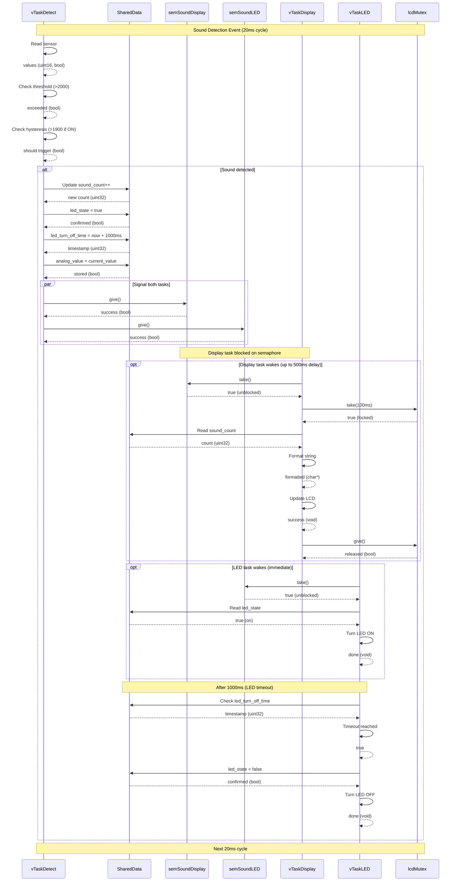