# Dual Sensor System - UML Diagrams

## 1. Architecture Diagram

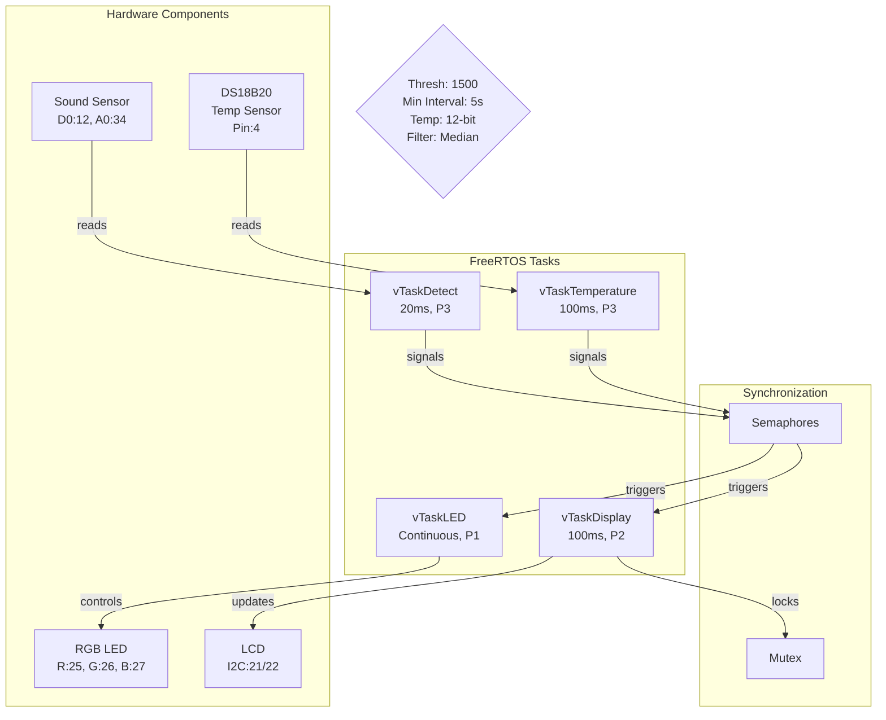

## 2. Component Diagram

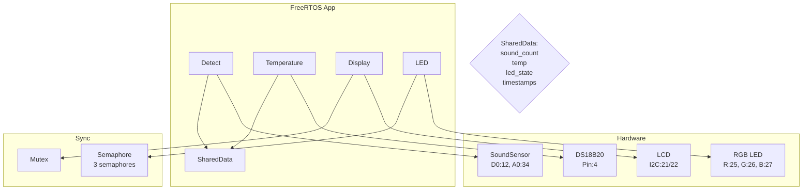

## 3. Class Diagram

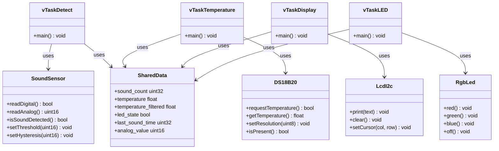

## 4. Detect Activity Diagram

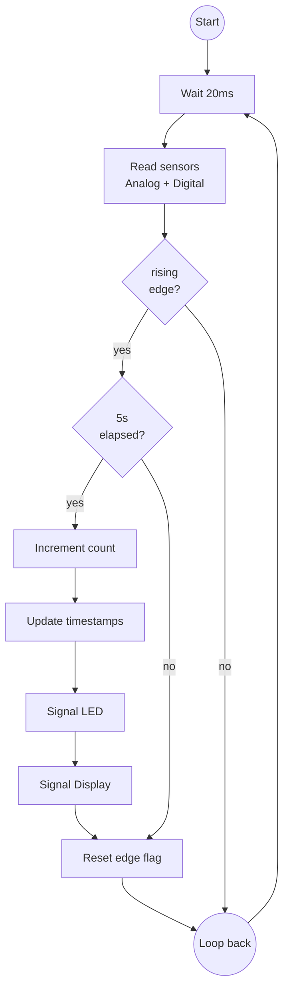

## 5. Temperature Activity Diagram

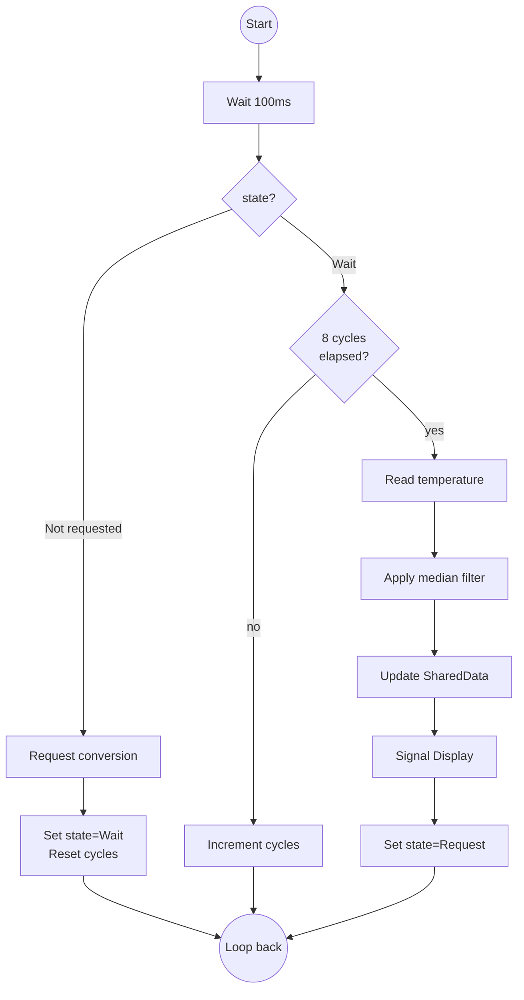

## 6. Display Activity Diagram

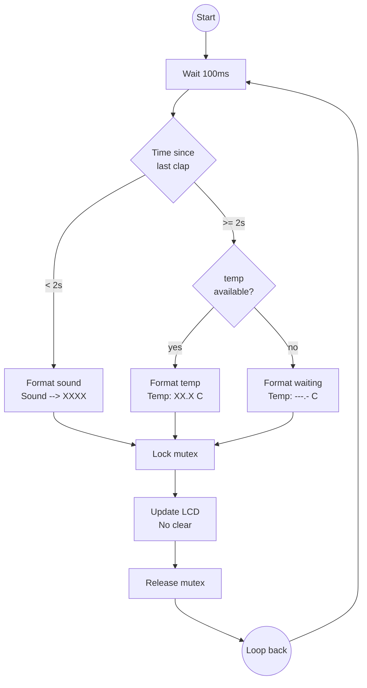

## 7. LED Activity Diagram

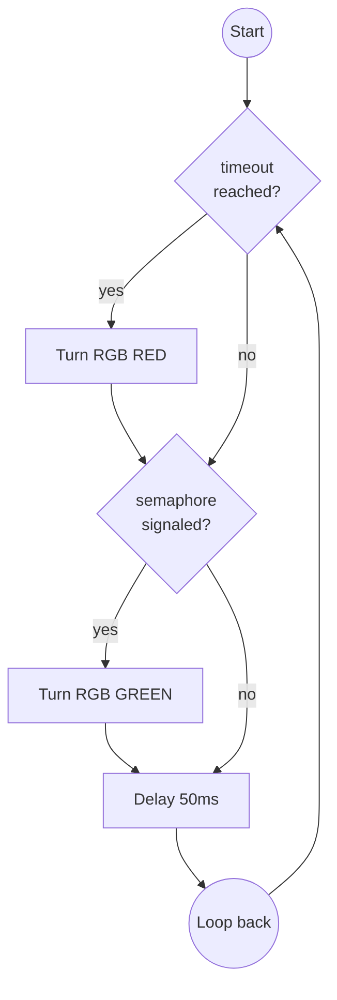

## 8. Data Flow Diagram

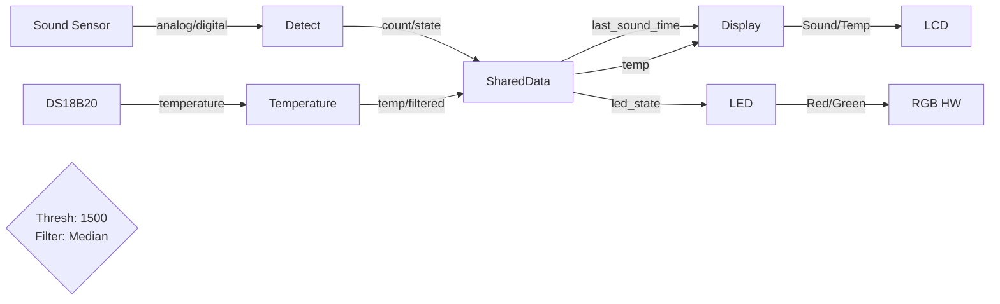

## 9. Software Layers Diagram

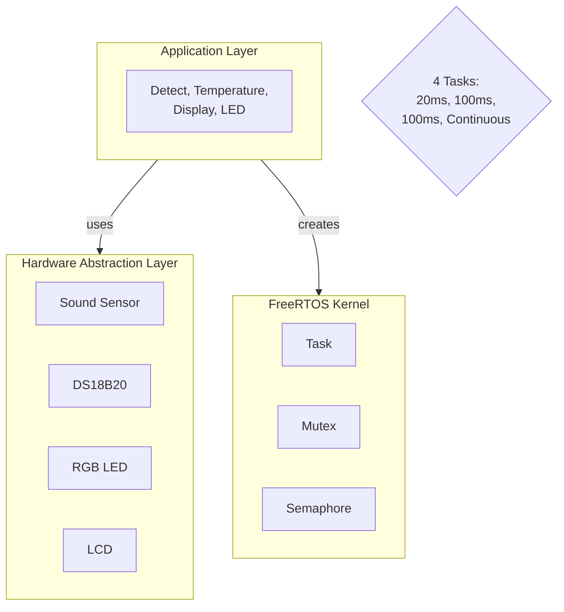

## 10. Detailed Low-Level Architecture

```mermaid
graph TB
    ESP32_Hardware[ESP32 Hardware<br/>ADC0: Pin 34<br/>GPIO12: Digital<br/>GPIO4: OneWire<br/>RGB: 25,26,27<br/>I2C: SDA21/SCL22]

    HAL[HAL Layer<br/>SoundSensor<br/>_digitalPin: 12<br/>_analogPin: 34<br/>_threshold: 1500<br/>_hysteresis: 50<br/><br/>DS18B20<br/>_pin: 4<br/>_resolution: 12<br/>_address: 8 bytes<br/>_deviceFound: bool<br/><br/>RgbLed<br/>_redPin: 25<br/>_greenPin: 26<br/>_bluePin: 27<br/><br/>LcdI2c<br/>_address: 0x27<br/>_cols: 16<br/>_rows: 2]

    Tasks[FreeRTOS Tasks<br/>vTaskDetect: 20ms P3<br/>Stack: 4096<br/><br/>vTaskTemperature: 100ms P3<br/>Stack: 4096<br/><br/>vTaskDisplay: 100ms P2<br/>Stack: 4096<br/><br/>vTaskLED: Continuous P1<br/>Stack: 4096]

    Sync[Sync Primitives<br/>lcdMutex: Mutex<br/>Timeout: 100ms<br/>Protects: LCD I2C<br/><br/>semSoundDisplay: Binary<br/>Trigger: Display<br/><br/>semSoundLED: Binary<br/>Trigger: LED<br/><br/>semTempDisplay: Binary<br/>Trigger: Display]

    Data[SharedData<br/>uint16_t analog_value<br/>uint32_t sound_count<br/>float temperature<br/>float temperature_filtered<br/>bool led_state<br/>uint32_t led_turn_off_time<br/>uint32_t last_sound_time<br/>uint32_t last_temperature_time<br/>float temperature_buffer[5]<br/>uint8_t temperature_buffer_index]

    Config[Configuration<br/>SOUND_THRESHOLD: 1500<br/>SOUND_HYSTERESIS: 50<br/>MIN_INTERVAL: 5000ms<br/>SOUND_DISPLAY: 2000ms<br/>TEMP_RESOLUTION: 12bits<br/>FILTER_SIZE: 5 samples]

    ESP32_Hardware -->|GPIO/ADC/OneWire| HAL
    HAL -->|methods| Tasks
    Tasks -->|uses| Sync
    Tasks -->|updates| Data
    Sync -->|protects| Data
    Config -->|used by| Tasks
```

## 11. Sound Sensor Sequence Diagram

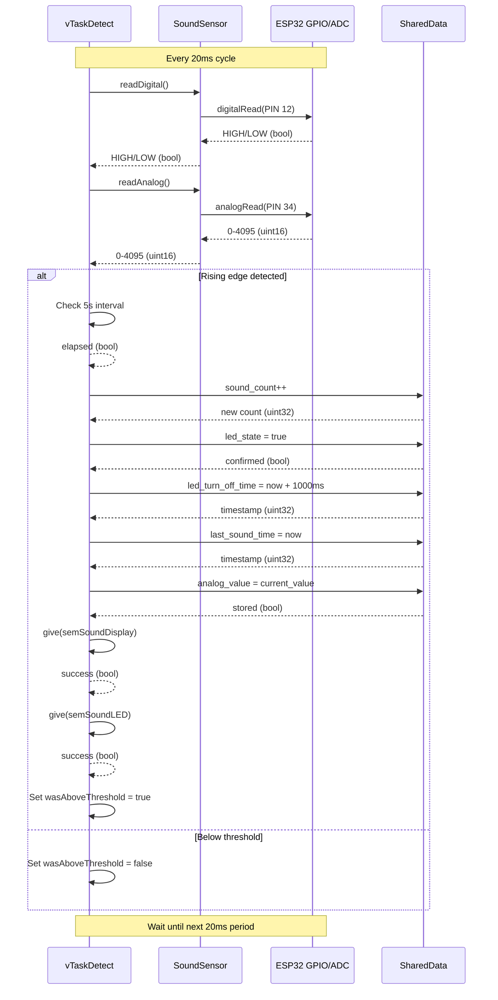

## 12. Temperature Sensor Sequence Diagram

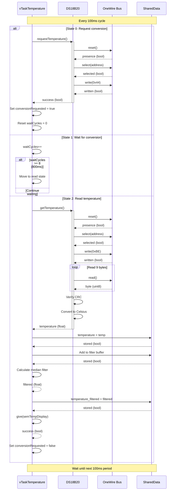

## 13. LCD Sequence Diagram

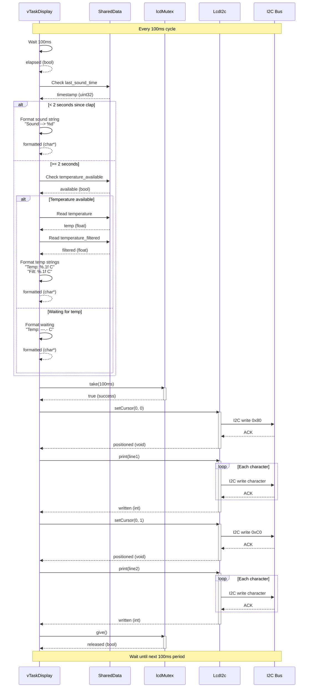

## 14. RGB LED Sequence Diagram

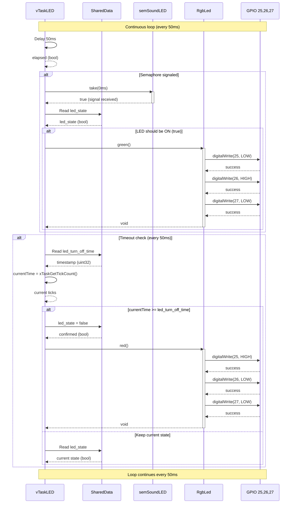

## 15. Data Flow - Sound Input Layer

```mermaid
graph LR
    subgraph Hardware_Input["Hardware Input Layer"]
        ADC[ADC0<br/>Pin: 34<br/>Function: Read analog<br/>Returns: 0-4095<br/>ESP32 ADC1_CH6]

        DIG[GPIO 12<br/>Function: Read digital<br/>Returns: HIGH/LOW<br/>Sound Sensor D0]

        SOUND[Sound Sensor HW<br/>Function: Detect sound<br/>Output: Digital/Analog<br/>Threshold: Adjustable]
    end

    subgraph HAL_Input["HAL Input Layer"]
        Sensor[SoundSensor<br/>readDigital(): digitalRead 12<br/>readAnalog(): analogRead 34<br/>isSoundDetected(): edge detection<br/>_lastDigitalState: bool<br/>_currentValue: uint16<br/>_threshold: 1500<br/>_hysteresis: 50]
    end

    subgraph Task_Input["Task Input Layer"]
        Detect[vTaskDetect<br/>Function: Read sensors<br/>Period: 20ms<br/>Priority: 3<br/>Rising edge detection]
    end

    SOUND -->|analog signal| ADC
    SOUND -->|digital signal| DIG

    ADC -->|value 0-4095| Sensor
    DIG -->|HIGH/LOW| Sensor

    Sensor -->|bool HIGH/LOW| Detect
    Sensor -->|uint16 0-4095| Detect
    Sensor -->|bool soundDetected| Detect
```

## 16. Data Flow - Temperature Input Layer

```mermaid
graph LR
    subgraph Hardware_Temp["Hardware Temperature Layer"]
        ONEWIRE[OneWire Bus<br/>Pin: 4<br/>Function: Digital comm<br/>Protocol: 1-Wire<br/>Pull-up: 4.7kΩ]

        DS18B20[DS18B20 Sensor<br/>Function: Measure temp<br/>Range: -55°C to +125°C<br/>Resolution: 12-bit<br/>Power: 3.3V/5V]
    end

    subgraph HAL_Temp["HAL Temperature Layer"]
        Temp[DS18B20<br/>requestTemperature(): Start conv<br/>getTemperature(): Read result<br/>setResolution(): 9-12 bits<br/>_pin: 4<br/>_address: 8 bytes<br/>_resolution: 12<br/>_deviceFound: bool<br/>_oneWire: OneWire*]
    end

    subgraph Task_Temp["Task Temperature Layer"]
        TempTask[vTaskTemperature<br/>Function: Read temp<br/>Period: 100ms<br/>Priority: 3<br/>State machine: 3 states]
    end

    DS18B20 -->|digital 1-wire| ONEWIRE
    ONEWIRE -->|digital protocol| Temp

    Temp -->|request| ONEWIRE
    Temp -->|read| ONEWIRE

    Temp -->|temperature float| TempTask
    Temp -->|success bool| TempTask
```

## 17. Data Flow - Processing Layer

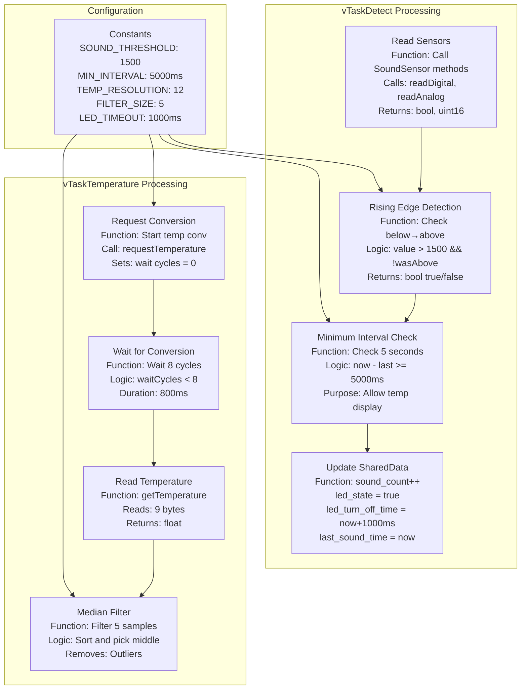

## 18. Data Flow - Storage Layer

```mermaid
graph TB
    subgraph Shared_Data["SharedData Structure"]
        Analog[analog_value<br/>Type: uint16<br/>Purpose: Store current ADC<br/>Writer: vTaskDetect<br/>Range: 0-4095]

        SoundCount[sound_count<br/>Type: uint32<br/>Purpose: Event counter<br/>Writer: vTaskDetect<br/>Reader: vTaskDisplay]

        LED_State[led_state<br/>Type: bool<br/>Purpose: RGB LED state<br/>Writer: vTaskDetect<br/>Reader: vTaskLED]

        LED_Time[led_turn_off_time<br/>Type: uint32<br/>Purpose: 1s timeout<br/>Writer: vTaskDetect<br/>Reader: vTaskLED]

        Last_Sound[last_sound_time<br/>Type: uint32<br/>Purpose: Last clap time<br/>Writer: vTaskDetect<br/>Reader: vTaskDisplay]

        Temperature[temperature<br/>Type: float<br/>Purpose: Raw temp reading<br/>Writer: vTaskTemperature<br/>Reader: vTaskDisplay]

        TempFiltered[temperature_filtered<br/>Type: float<br/>Purpose: Filtered temp<br/>Writer: vTaskTemperature<br/>Reader: vTaskDisplay]

        TempBuffer[temperature_buffer[5]<br/>Type: float array<br/>Purpose: Circular buffer<br/>Writer: vTaskTemperature<br/>Size: 5 samples]
    end

    subgraph Memory["Memory Access"]
        WriteDetect[Write: vTaskDetect<br/>Period: 20ms<br/>Priority: 3<br/>Writes: sound_count, led_state,<br/>last_sound_time, analog_value]

        WriteTemp[Write: vTaskTemperature<br/>Period: 800ms<br/>Priority: 3<br/>Writes: temperature,<br/>temperature_filtered,<br/>temperature_buffer]

        ReadDisplay[Read: vTaskDisplay<br/>Period: 100ms<br/>Priority: 2<br/>Reads: sound_count,<br/>temperature, temperature_filtered]

        ReadLED[Read: vTaskLED<br/>Continuous<br/>Priority: 1<br/>Reads: led_state,<br/>led_turn_off_time]
    end

    WriteDetect -->|store| Analog
    WriteDetect -->|increment| SoundCount
    WriteDetect -->|set| LED_State
    WriteDetect -->|set| LED_Time
    WriteDetect -->|set| Last_Sound

    WriteTemp -->|set| Temperature
    WriteTemp -->|set| TempFiltered
    WriteTemp -->|update| TempBuffer

    ReadDisplay -->|read| SoundCount
    ReadDisplay -->|read| Temperature
    ReadDisplay -->|read| TempFiltered
    ReadDisplay -->|read| Last_Sound

    ReadLED -->|read| LED_State
    ReadLED -->|read| LED_Time
```

## 19. Data Flow - Display Output

```mermaid
graph LR
    subgraph Display_Task["vTaskDisplay Output"]
        Wait[Wait 100ms<br/>Function: vTaskDelayUntil<br/>Period: 100ms<br/>Priority: 2]

        CheckTime[Check Time<br/>Function: Compare timestamps<br/>Logic: now - last_sound_time<br/>Duration: 2000ms]

        FormatSound[Format Sound<br/>Function: snprintf<br/>Format: Sound --> %d<br/>Buffer: 16 chars]

        FormatTemp[Format Temp<br/>Function: snprintf<br/>Format: Temp: %.1f C<br/>Buffer: 16 chars]

        Lock[Lock Mutex<br/>Function: lcdMutex.take<br/>Timeout: 100ms<br/>Purpose: Protect I2C]
    end

    subgraph LCD_Hardware["LCD Hardware"]
        I2C[I2C Bus<br/>SDA: Pin 21<br/>SCL: Pin 22<br/>Address: 0x27<br/>Speed: 100kHz]

        LCD[LCD Controller<br/>Type: PCF8574<br/>Size: 16x2 chars<br/>Function: Display text]
    end

    subgraph LCD_Ops["LCD Operations"]
        Cursor[Set Cursor<br/>Row 0: 0x80<br/>Row 1: 0xC0<br/>Function: lcd.setCursor]

        Write[Write Text<br/>Function: lcd.print<br/>Chars: ASCII<br/>Returns: void]

        NoClear[No Clear<br/>Optimization: Don't clear<br/>Purpose: Reduce flicker]
    end

    Wait --> CheckTime

    CheckTime -->|< 2000ms| FormatSound
    CheckTime -->|>= 2000ms| FormatTemp

    FormatSound --> Lock
    FormatTemp --> Lock

    Lock --> I2C
    I2C --> LCD

    LCD --> NoClear
    NoClear --> Cursor
    Cursor --> Write

    Unlock[Unlock Mutex<br/>Function: lcdMutex.give<br/>Release I2C<br/>Next task]

    Write --> Unlock
    Unlock --> I2C
```

## 20. Data Flow - RGB LED Output

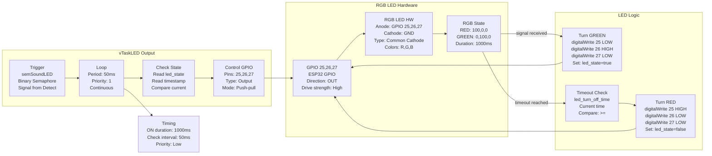

## 21. Data Flow - Synchronization

```mermaid
graph TB
    subgraph Semaphores["Binary Semaphores"]
        Sem1[semSoundDisplay<br/>Type: Binary Semaphore<br/>Handle: SemaphoreHandle_t<br/>Creator: Detect<br/>Waiter: Display<br/>Trigger: Sound event]

        Sem2[semSoundLED<br/>Type: Binary Semaphore<br/>Handle: SemaphoreHandle_t<br/>Creator: Detect<br/>Waiter: LED<br/>Trigger: Sound event]

        Sem3[semTempDisplay<br/>Type: Binary Semaphore<br/>Handle: SemaphoreHandle_t<br/>Creator: Temperature<br/>Waiter: Display<br/>Trigger: Temp ready]
    end

    subgraph Mutex["Mutex Protection"]
        Mutex1[lcdMutex<br/>Type: Mutex<br/>Handle: SemaphoreHandle_t<br/>Protects: I2C LCD<br/>Timeout: 100ms<br/>Owner: Display]
    end

    subgraph Operations["Semaphore Operations"]
        Give[Give (signal)<br/>xSemaphoreGive<br/>Return: pdTRUE<br/>Unblocks task<br/>Non-blocking]

        Take[Take (wait)<br/>xSemaphoreTake<br/>Return: pdTRUE/FALSE<br/>Timeout: specified<br/>Blocking]
    end

    subgraph Flow["Signal Flow"]
        Detect[Detect Task<br/>Priority: 3<br/>Period: 20ms<br/>Signal giver]

        Temp[Temperature Task<br/>Priority: 3<br/>Period: 800ms<br/>Signal giver]

        Display[Display Task<br/>Priority: 2<br/>Period: 100ms<br/>Signal waiter<br/>Auto-switch logic]

        LED[LED Task<br/>Priority: 1<br/>Continuous<br/>Signal waiter<br/>Max wait: 0ms]
    end

    Detect -->|sound detected| Sem1
    Detect -->|sound detected| Sem2

    Temp -->|temp ready| Sem3

    Sem1 -->|trigger| Display
    Sem2 -->|trigger| LED
    Sem3 -->|trigger| Display

    Display -->|take| Sem1
    Display -->|take| Sem3
    LED -->|take| Sem2

    Sem1 -->|give| Detect
    Sem2 -->|give| Detect
    Sem3 -->|give| Temp

    Display -->|lock| Mutex1
    Mutex1 -->|unlock| Display

    Give --> Sem1
    Take --> Sem1
    Give --> Sem2
    Take --> Sem2
    Give --> Sem3
    Take --> Sem3

    Sync[Sync Pattern<br/>Detect: Signal (2 semaphores)<br/>Temp: Signal (1 semaphore)<br/>Display: Wait/Auto-switch<br/>LED: Wait/Control<br/>LCD: Lock/Write]

    Detect --> Sync
    Temp --> Sync
    Display --> Sync
    LED --> Sync
```

## 22. Display Auto-Switch Sequence Diagram

```mermaid
sequenceDiagram
    participant D as vTaskDisplay
    participant SD as SharedData
    participant M as lcdMutex
    participant LCD as LcdI2c
    participant I2C as I2C Bus

    Note over D,I2C: Display Auto-Switch Logic

    Note over D,SD: Initial state (idle)
    D->>SD: Check last_sound_time
    SD-->>D: timestamp

    D->>D: now - last_sound_time >= 2000ms
    D-->>D: true (show temp)

    D->>M: take(100ms)
    activate M
    M-->>D: true
    deactivate M

    D->>LCD: print("Temp: 26.5 C")
    activate LCD
    LCD->>I2C: I2C write
    I2C-->>LCD: ACK
    LCD-->>D: written
    deactivate LCD

    D->>LCD: print("Filt: 26.6 C")
    activate LCD
    LCD->>I2C: I2C write
    I2C-->>LCD: ACK
    LCD-->>D: written
    deactivate LCD

    D->>M: give()
    activate M
    M-->>D: released
    deactivate M

    Note over D,SD: Clap detected (by vTaskDetect)
    D->>SD: last_sound_time = now
    SD-->>D: updated

    Note over D,SD: Next display cycle (< 2s)
    D->>SD: Check last_sound_time
    SD-->>D: timestamp

    D->>D: now - last_sound_time < 2000ms
    D-->>D: true (show sound)

    D->>M: take(100ms)
    activate M
    M-->>D: true
    deactivate M

    D->>LCD: print("Sound --> 2527")
    activate LCD
    LCD->>I2C: I2C write
    I2C-->>LCD: ACK
    LCD-->>D: written
    deactivate LCD

    D->>LCD: print("Clap!")
    activate LCD
    LCD->>I2C: I2C write
    I2C-->>LCD: ACK
    LCD-->>D: written
    deactivate LCD

    D->>M: give()
    activate M
    M-->>D: released
    deactivate M

    Note over D,SD: 2 seconds elapsed
    D->>SD: Check last_sound_time
    SD-->>D: timestamp

    D->>D: now - last_sound_time >= 2000ms
    D-->>D: true (show temp)

    Note over D,SD: Returns to temperature display
```

## 23. Complete System Timeline

```mermaid
gantt
    title Dual Sensor System Timeline (Single Clap Event)
    dateFormat s
    axisFormat %Ss

    section vTaskDetect
    Read Sensors        :0, 0.02
    Check Threshold     :0.02, 0.02
    Update SharedData   :0.04, 0.01
    Signal Semaphores   :0.05, 0.01

    section vTaskTemperature
    Request Conversion  :0, 0.01
    Wait 800ms         :0.01, 0.8
    Read Temperature    :0.81, 0.01
    Median Filter       :0.82, 0.01
    Signal Display      :0.83, 0.01

    section vTaskDisplay
    Show Temperature    :0, 2
    Show Sound Level    :0, 2
    Show Temperature    :2, 5

    section vTaskLED
    Set RED (idle)      :0, 0.01
    Set GREEN (clap)    :0, 0.01
    Wait 1s             :0.01, 1
    Set RED (timeout)   :1.01, 0.01
    Set RED (idle)      :1.02, 5
```

## 24. State Machine - Temperature Task

```mermaid
stateDiagram-v2
    [*] --> Request

    Request --> Wait: requestTemperature()
    Wait --> Wait: waitCycles++
    Wait --> Read: waitCycles >= 8

    Read --> Filter: getTemperature()
    Filter --> Update: median calculation
    Update --> Signal: update SharedData
    Signal --> Request: semTempDisplay.give()
```

## 25. State Machine - Display Mode

```mermaid
stateDiagram-v2
    [*] --> Temperature

    Temperature --> Sound: clap detected<br/>(last_sound_time < 2s)
    Sound --> Temperature: 2s elapsed<br/>(last_sound_time >= 2s)

    note right of Temperature
        Display:
        Line 1: "Temp: XX.X C"
        Line 2: "Filt: XX.X C"
        RGB LED: RED
    end note

    note right of Sound
        Display:
        Line 1: "Sound --> XXXX"
        Line 2: "Clap!"
        RGB LED: GREEN
    end note
```

## 26. State Machine - RGB LED

```mermaid
stateDiagram-v2
    [*] --> Red

    Red --> Green: clap detected<br/>(semSoundLED)
    Green --> Red: 1s timeout<br/>(led_turn_off_time)

    note right of Red
        State: Idle
        Color: RED
        Pin 25: HIGH
        Pin 26: LOW
        Pin 27: LOW
    end note

    note right of Green
        State: Active
        Color: GREEN
        Pin 25: LOW
        Pin 26: HIGH
        Pin 27: LOW
        Duration: 1s
    end note
```

## 27. Median Filter Algorithm

```mermaid
flowchart TD
    Start((Start)) --> Add[Add new temp<br/>to buffer]
    Add --> Index[Update index<br/>(index + 1) % 5]
    Index --> Copy[Copy buffer to<br/>sorted array]
    Copy --> Sort1[Pass 1: Sort<br/>Compare & swap]
    Sort1 --> Sort2[Pass 2: Sort<br/>Compare & swap]
    Sort2 --> Sort3[Pass 3: Sort<br/>Compare & swap]
    Sort3 --> Sort4[Pass 4: Sort<br/>Compare & swap]
    Sort4 --> Median[Pick middle<br/>index 2]
    Median --> Output[Return filtered<br/>temperature]
    Output --> End((End))

    note1{Example:<br/>Raw: 26.5, 30.2, 26.3, 26.4, 26.6<br/>Sorted: 26.3, 26.4, 26.5, 26.6, 30.2<br/>Median: 26.5°C}
```

## 28. Task Synchronization Sequence Diagram

```mermaid
sequenceDiagram
    participant D as vTaskDetect
    participant T as vTaskTemperature
    participant SD as SharedData
    participant SemD as semSoundDisplay
    participant SemL as semSoundLED
    participant SemT as semTempDisplay
    participant Disp as vTaskDisplay
    participant LED as vTaskLED
    participant M as lcdMutex

    Note over D,M: System Operation

    par Parallel Execution
        D->>D: Read sound sensor
        D->>D: Check rising edge
        D->>D: Check 5s interval

        alt Clap detected
            D->>SD: Update sound data
            D->>SemD: give()
            D->>SemL: give()
        end

        Note over SemD,Disp: Display auto-switch logic

        opt < 2s since clap
            Disp->>SemD: take()
            Disp->>M: take()
            Disp->>LCD: Show sound
            Disp->>M: give()
        else >= 2s
            alt Temp available
                Disp->>SemT: take()
                Disp->>M: take()
                Disp->>LCD: Show temperature
                Disp->>M: give()
            end
        end

        Note over SemL,LED: LED timeout logic

        opt Semaphore signaled
            LED->>SemL: take()
            LED->>LED: Set GREEN
        end

        opt 1s elapsed
            LED->>LED: Check timeout
            LED->>LED: Set RED
        end
    and
        T->>T: Check state

        alt State: Request
            T->>T: requestTemperature()
            T->>T: Set state=Wait
        else State: Wait
            T->>T: waitCycles++
            alt waitCycles >= 8
                T->>T: Move to Read
            end
        else State: Read
            T->>T: getTemperature()
            T->>T: Median filter
            T->>SD: Update temp data
            T->>SemT: give()
            T->>T: Set state=Request
        end
    end

    Note over D,M: Next cycle
```