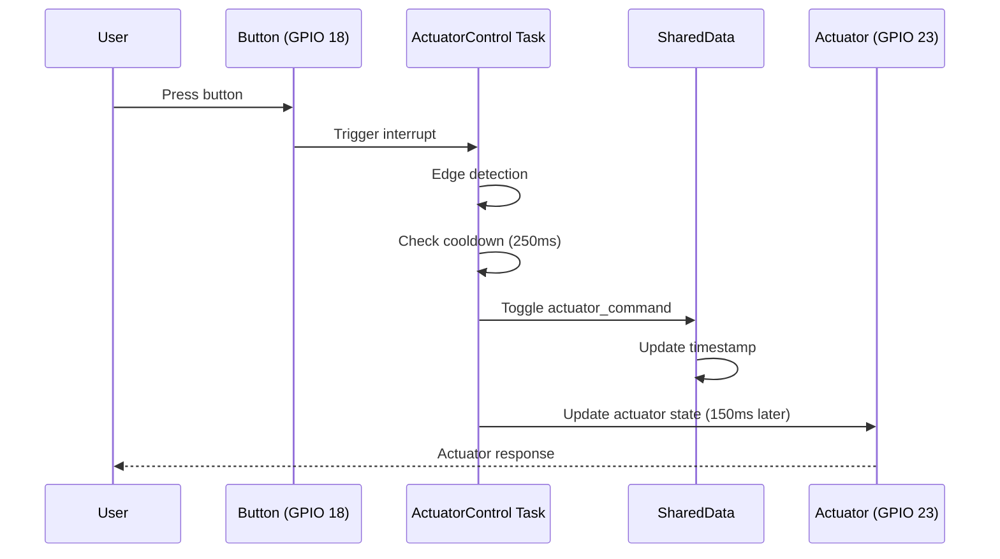
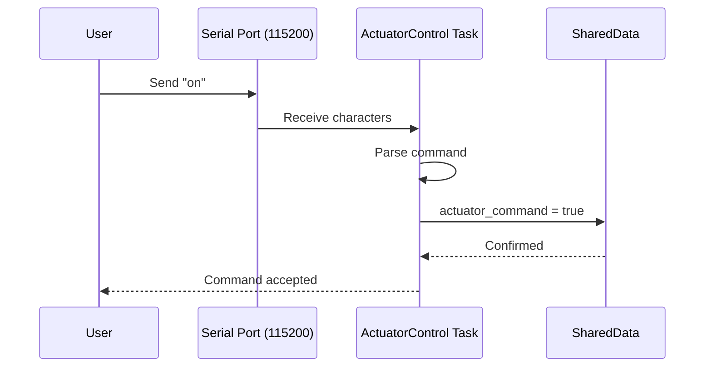
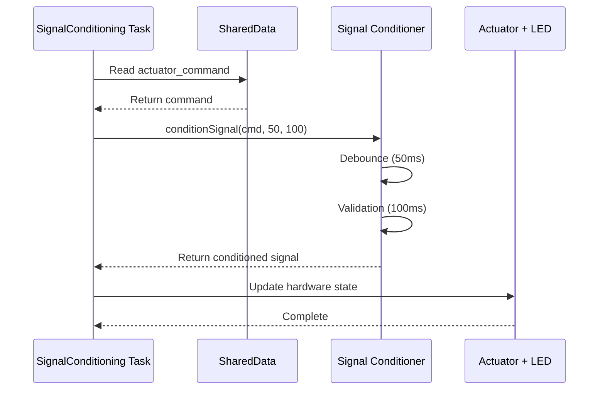
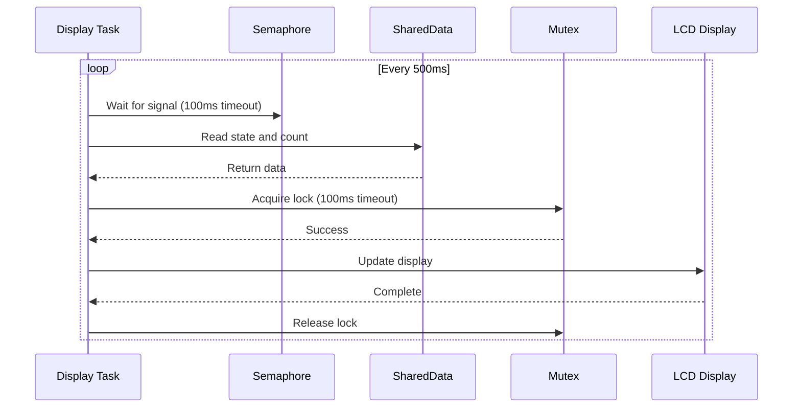
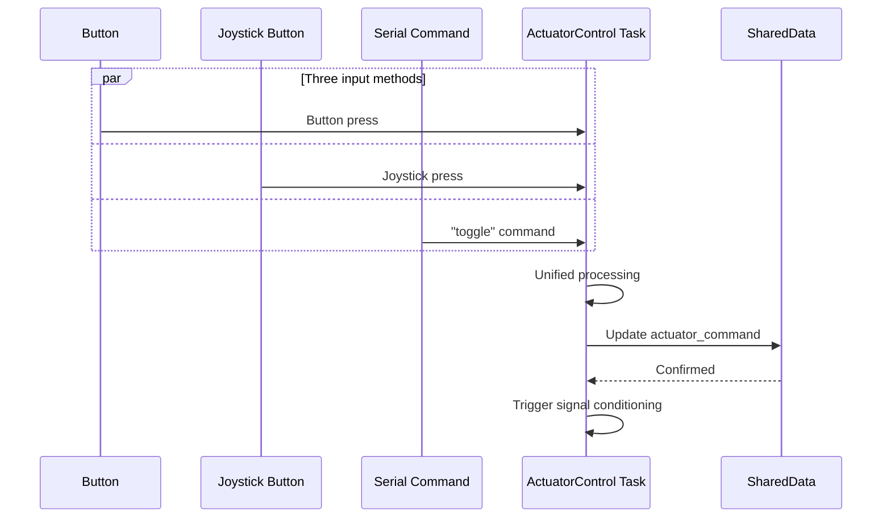
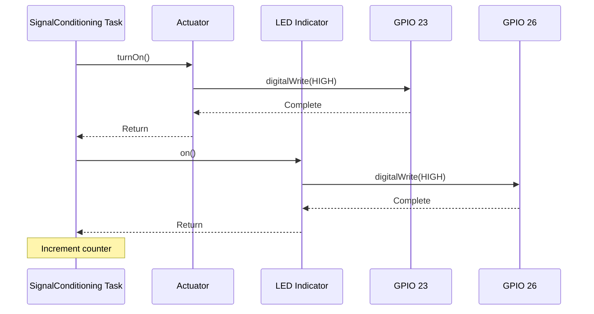
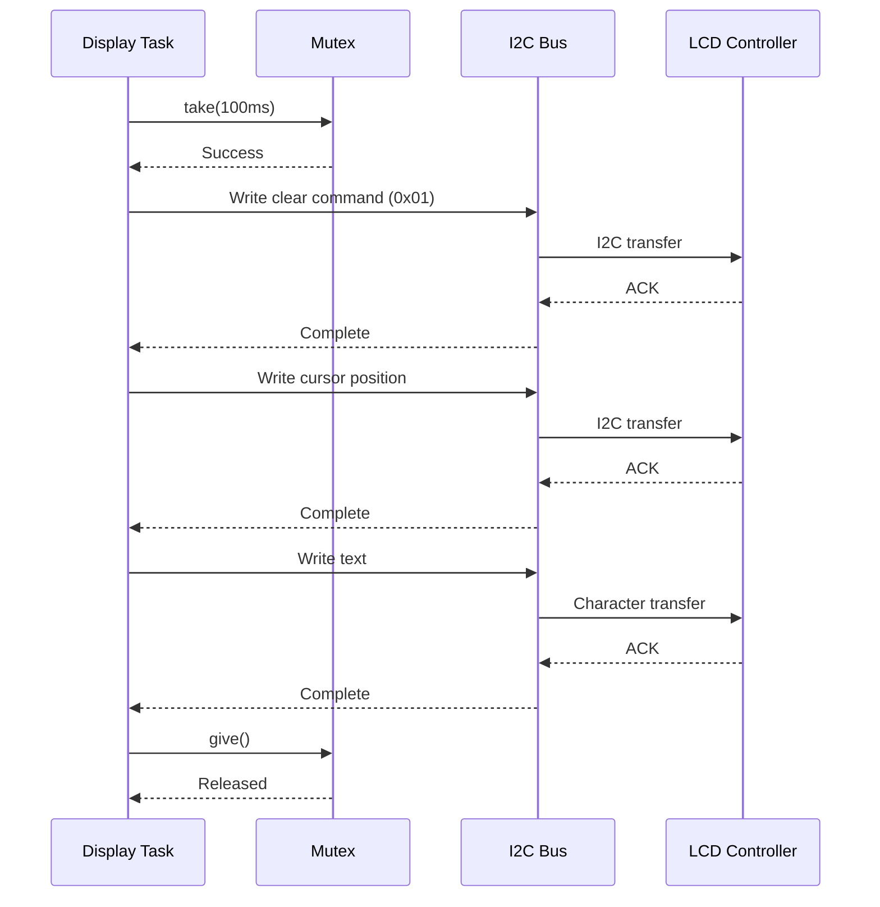
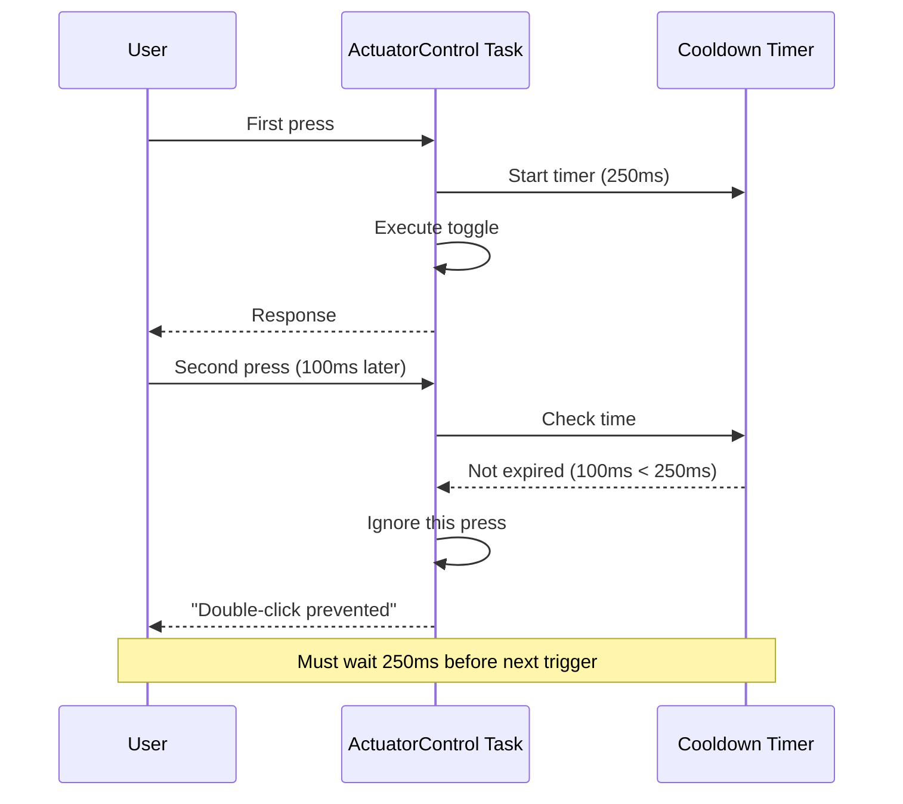
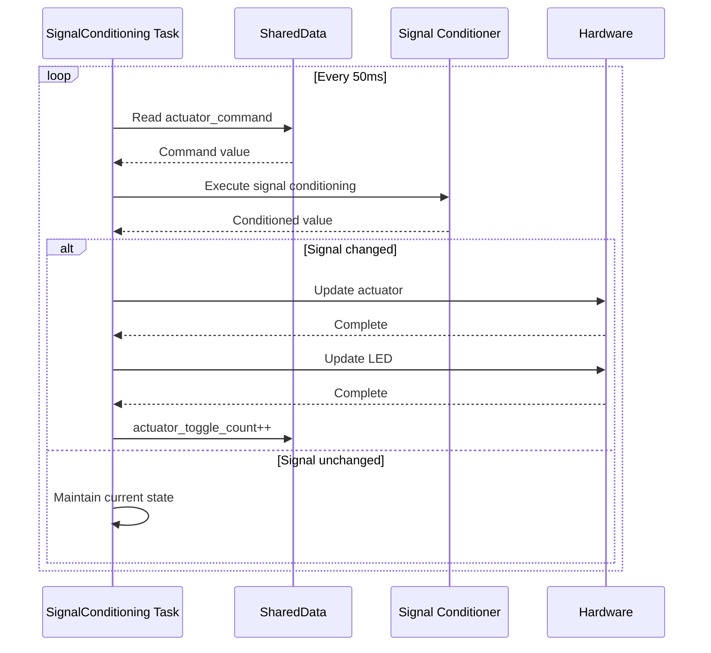
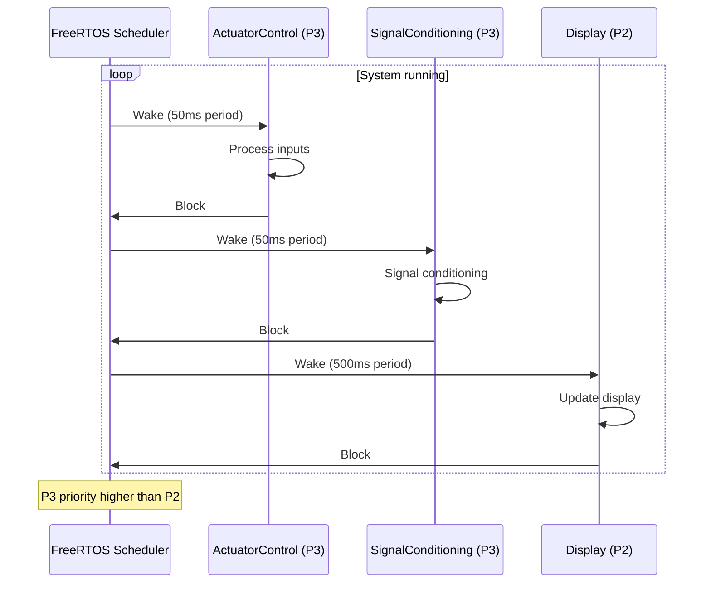

# Simplified Sequence Diagrams - Actuator Control System

## Overview

This document contains simplified sequence diagrams, each focusing on a specific interaction in the system.

## 1. Button Control Flow

## 2. Serial Command Processing

## 3. Signal Conditioning Process

## 4. Display Update Flow

## 5. Multi-Input Coordination

## 6. Hardware Control Details

## 7. I2C LCD Communication

## 8. Double-Click Protection

## 9. State Change Detection

## 10. Task Scheduling

