# Actuator Control System - UML Diagrams

## 1. Architecture Diagram

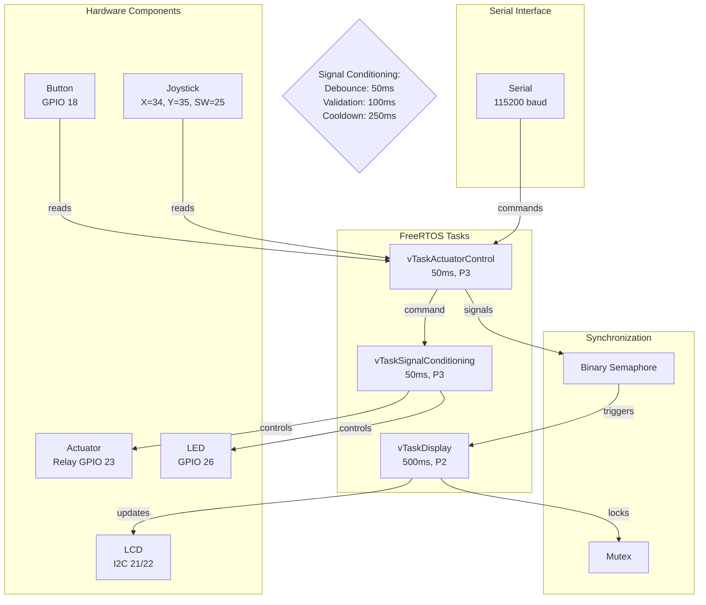

## 2. Component Diagram

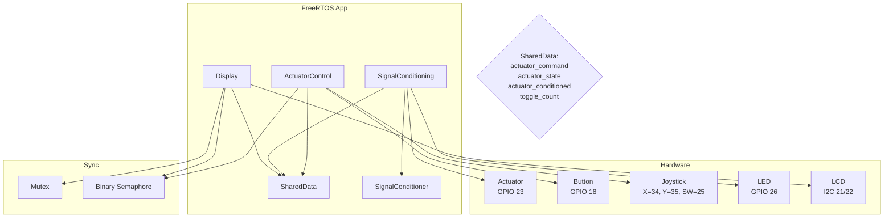

## 3. Class Diagram

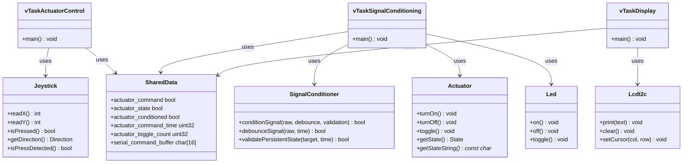

## 4. ActuatorControl Activity Diagram

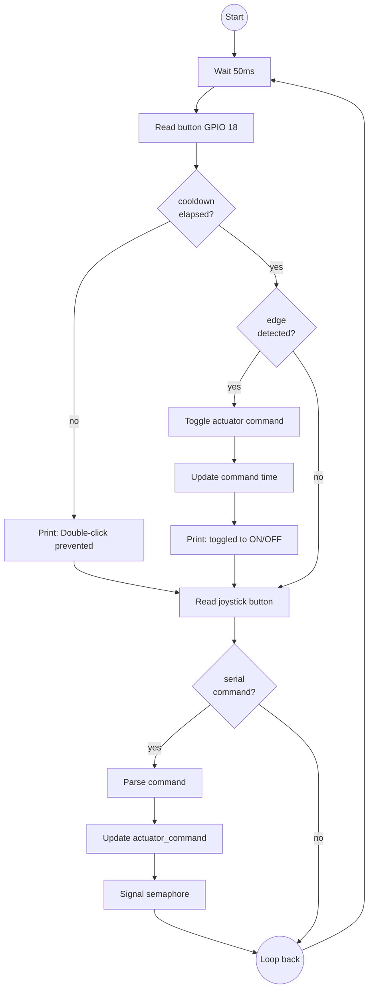

## 5. SignalConditioning Activity Diagram

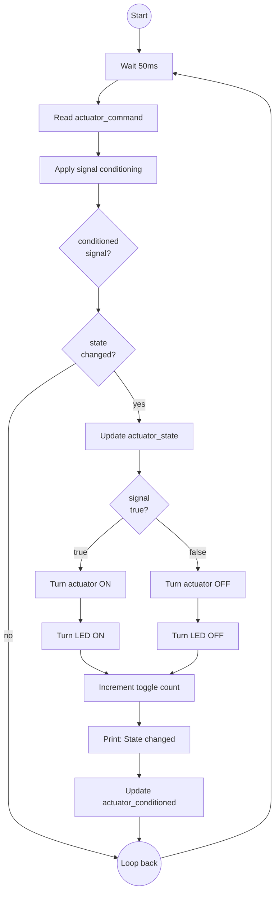

## 6. Display Activity Diagram

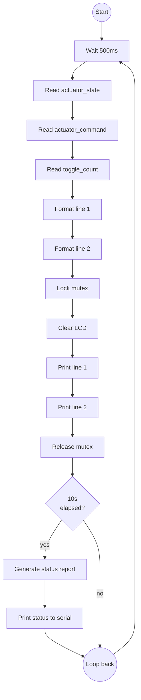

## 7. Data Flow Diagram

```mermaid
graph LR
    Button[Button<br/>GPIO 18] -->|digital| ActCtrl[ActuatorControl]
    Joystick[Joystick<br/>GPIO 25] -->|digital| ActCtrl
    Serial[Serial<br/>115200] -->|commands| ActCtrl
    ActCtrl -->|command| SharedData[SharedData]
    SharedData -->|command| SigCond[SignalConditioning]
    SigCond -->|conditioned| Actuator[Actuator<br/>GPIO 23]
    SigCond -->|state| LED[LED<br/>GPIO 26]
    SharedData -->|state| Display[Display]
    Display -->|Actuator: ON/OFF| LCD[LCD<br/>I2C 21/22]

    note1{Conditioning:<br/>Debounce: 50ms<br/>Validation: 100ms}
```

## 8. Software Layers Diagram

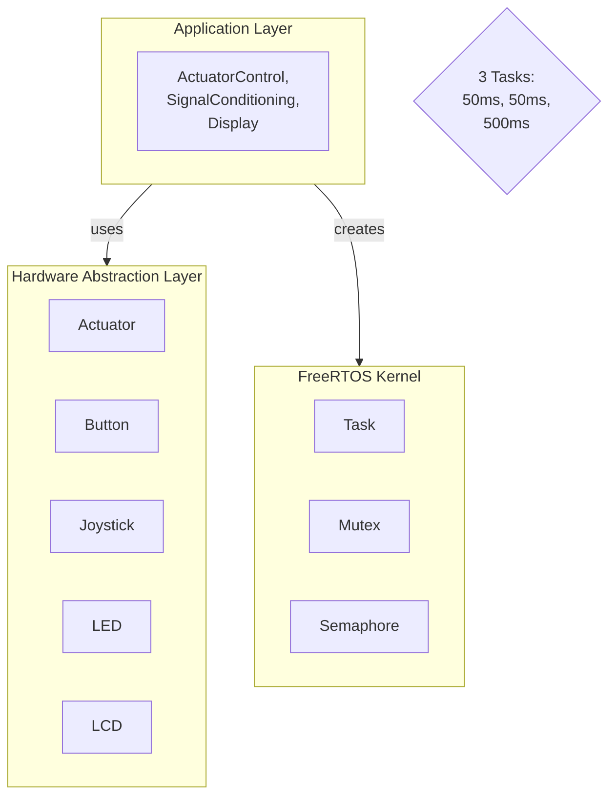

## 9. Detailed Low-Level Architecture

```mermaid
graph TB
    ESP32_Hardware[ESP32 Hardware<br/>GPIO 18: Button<br/>GPIO 23: Actuator<br/>GPIO 25: Joystick SW<br/>GPIO 34/35: Joystick X/Y<br/>GPIO 26: LED<br/>I2C: SDA21/SCL22]
    
    HAL[HAL Layer<br/>Actuator<br/>_pin: 23<br/>_state: State<br/><br/>Joystick<br/>_pinX: 34<br/>_pinY: 35<br/>_pinSW: 25<br/><br/>Led<br/>_pin: 26<br/>_state: bool<br/><br/>LcdI2c<br/>_address: 0x27<br/>_cols: 16<br/>_rows: 2]
    
    Tasks[FreeRTOS Tasks<br/>vTaskActuatorControl: 50ms P3<br/>Stack: 4096<br/><br/>vTaskSignalConditioning: 50ms P3<br/>Stack: 4096<br/><br/>vTaskDisplay: 500ms P2<br/>Stack: 4096]
    
    Sync[Sync Primitives<br/>lcdMutex: Mutex<br/>Timeout: 100ms<br/>Protects: LCD I2C<br/><br/>semActuatorDisplay: Binary<br/>Trigger: Display]
    
    Data[SharedData<br/>bool actuator_command<br/>bool actuator_state<br/>bool actuator_conditioned<br/>uint32_t actuator_command_time<br/>uint32_t actuator_toggle_count<br/>char serial_command_buffer[16]]

    Config[Configuration<br/>DEBOUNCE_TIME: 50ms<br/>VALIDATION_TIME: 100ms<br/>BUTTON_COOLDOWN: 250ms<br/>ACTUATOR_CONTROL_PERIOD: 50ms<br/>SIGNAL_CONDITIONING_PERIOD: 50ms<br/>DISPLAY_PERIOD: 500ms]

    ESP32_Hardware -->|GPIO/ADC| HAL
    HAL -->|methods| Tasks
    Tasks -->|uses| Sync
    Tasks -->|updates| Data
    Sync -->|protects| Data
    Config -->|used by| Tasks
```

## 10. ActuatorControl Sequence Diagram

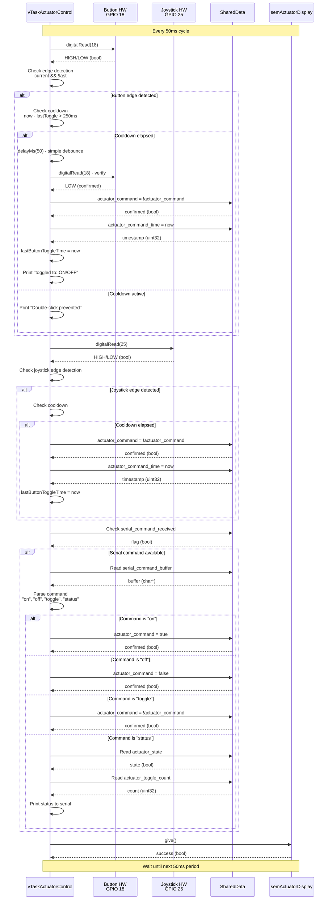

## 11. SignalConditioning Sequence Diagram

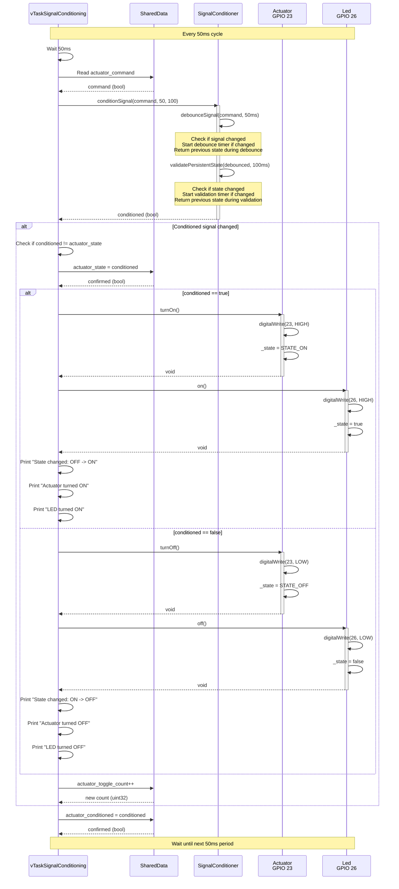

## 12. Display Sequence Diagram

```mermaid
sequenceDiagram
    participant D as vTaskDisplay
    participant SD as SharedData
    participant Sem as semActuatorDisplay
    participant M as lcdMutex
    participant LCD as LcdI2c
    participant I2C as I2C Bus

    Note over D,I2C: Every 500ms cycle

    D->>D: Wait 500ms
    D-->>D: elapsed (bool)

    D->>Sem: take(100ms)
    activate Sem
    alt Semaphore signaled
        Sem-->>D: true (unblocked)
        deactivate Sem

        D->>SD: Read actuator_state
        SD-->>D: state (bool)

        D->>SD: Read actuator_command
        SD-->>D: command (bool)

        D->>SD: Read actuator_toggle_count
        SD-->>D: count (uint32)

        D->>D: Format line 1<br/>snprintf("Actuator: %s", state)
        D-->>D: string (char*)

        D->>D: Format line 2<br/>snprintf("Cmd: %s Tog:%lu", cmd, count)
        D-->>D: string (char*)

        D->>M: take(100ms)
        activate M
        M-->>D: true (locked)
        deactivate M

        D->>LCD: clear()
        activate LCD
        LCD->>I2C: I2C write 0x01 (clear command)
        I2C-->>LCD: ACK (0x00)
        LCD-->>D: cleared (void)
        deactivate LCD

        D->>D: delayMs(50)

        D->>LCD: setCursor(0, 0)
        activate LCD
        LCD->>I2C: I2C write 0x80 (DDRAM address)
        I2C-->>LCD: ACK (0x00)
        LCD->>I2C: I2C write 0x00 (row 0, col 0)
        I2C-->>LCD: ACK (0x00)
        LCD-->>D: positioned (void)
        deactivate LCD

        D->>LCD: print(line1)
        activate LCD
        loop Each character of line1
            LCD->>I2C: I2C write character
            I2C-->>LCD: ACK (0x00)
        end
        LCD-->>D: written (int)
        deactivate LCD

        D->>D: delayMs(50)

        D->>LCD: setCursor(0, 1)
        activate LCD
        LCD->>I2C: I2C write 0xC0 (DDRAM address)
        I2C-->>LCD: ACK (0x00)
        LCD-->>D: positioned (void)
        deactivate LCD

        D->>LCD: print(line2)
        activate LCD
        loop Each character of line2
            LCD->>I2C: I2C write character
            I2C-->>LCD: ACK (0x00)
        end
        LCD-->>D: written (int)
        deactivate LCD

        D->>M: give()
        activate M
        M-->>D: released (bool)
        deactivate M

        D->>D: Check if 10 seconds elapsed

        alt 10 seconds elapsed
            D->>SD: Read actuator_state
            SD-->>D: state (bool)

            D->>SD: Read actuator_command
            SD-->>D: command (bool)

            D->>SD: Read actuator_toggle_count
            SD-->>D: count (uint32)

            D->>D: Print status report to serial
        end
    else Semaphore timeout
        Sem-->>D: false (timeout)
        deactivate Sem

        D->>D: Continue with periodic update
    end

    Note over D,I2C: Wait until next 500ms period
```

## 13. Data Flow - Input Layer

```mermaid
graph LR
    subgraph Hardware_Input["Hardware Input Layer"]
        BTN[Button<br/>GPIO 18<br/>Function: Read digital<br/>Returns: HIGH/LOW<br/>ESP32 GPIO<br/>Internal pull-up]
        
        JS[Joystick Button<br/>GPIO 25<br/>Function: Read digital<br/>Returns: HIGH/LOW<br/>ESP32 GPIO<br/>Internal pull-up]
        
        JSX[Joystick X<br/>GPIO 34<br/>Function: Read analog<br/>Returns: 0-4095<br/>ESP32 ADC1_CH6]
        
        JSY[Joystick Y<br/>GPIO 35<br/>Function: Read analog<br/>Returns: 0-4095<br/>ESP32 ADC1_CH7]
        
        UART[Serial UART<br/>Function: Read characters<br/>Baud: 115200<br/>ESP32 UART0<br/>Commands: on/off/toggle/status]
    end

    subgraph HAL_Input["HAL Input Layer"]
        Joystick[Joystick<br/>readX(): analogRead 34<br/>readY(): analogRead 35<br/>isPressed(): digitalRead 25<br/>_lastButtonState: bool<br/>_pressStartTime: uint32]
    end

    subgraph Task_Input["Task Input Layer"]
        ActCtrl[vTaskActuatorControl<br/>Function: Read inputs<br/>Period: 50ms<br/>Priority: 3<br/>Methods: digitalRead, serial read]
    end

    BTN -->|HIGH/LOW| ActCtrl
    JS -->|HIGH/LOW| ActCtrl
    JSX -->|0-4095| Joystick
    JSY -->|0-4095| Joystick
    UART -->|characters| ActCtrl
    Joystick -->|button state| ActCtrl
```

## 14. Data Flow - Processing Layer

```mermaid
graph TB
    subgraph Actuator_Control_Task["vTaskActuatorControl Processing"]
        Read[Read Inputs<br/>Function: digitalRead GPIO 18, 25<br/>Read serial buffer<br/>Returns: bool, char*]
        
        Edge[Edge Detection<br/>Function: Check rising edge<br/>Logic: current && !last<br/>Returns: bool true/false]
        
        Cooldown[Cooldown Check<br/>Function: Check time elapsed<br/>Logic: now - lastToggle > 250ms<br/>Purpose: Prevent double-click]
        
        Debounce[Simple Debounce<br/>Function: delayMs(50)<br/>Purpose: Verify button state]
        
        Parse[Parse Serial<br/>Function: Parse command string<br/>Commands: on, off, toggle, status<br/>Returns: action enum]
        
        UpdateCmd[Update Command<br/>Function: actuator_command = new_value<br/>Update command timestamp<br/>Signal display task]
    end

    subgraph Signal_Conditioning_Task["vTaskSignalConditioning Processing"]
        ReadCmd[Read Command<br/>Function: Read actuator_command<br/>From: SharedData<br/>Type: bool]
        
        ApplyDebounce[Apply Debounce<br/>Function: SignalConditioner.debounce<br/>Time: 50ms<br/>Purpose: Filter noise]
        
        ApplyValidation[Apply Validation<br/>Function: SignalConditioner.validate<br/>Time: 100ms<br/>Purpose: Confirm stability]
        
        CheckChange[Check State Change<br/>Function: Compare conditioned vs state<br/>Logic: if changed -> update hardware]
        
        UpdateHW[Update Hardware<br/>Function: Turn actuator ON/OFF<br/>Turn LED ON/OFF<br/>Increment toggle count]
    end

    subgraph Timing["Timing Control"]
        Timer1[50ms Timer<br/>Function: vTaskDelayUntil<br/>Returns: after 50ms<br/>Task: ActuatorControl]
        
        Timer2[50ms Timer<br/>Function: vTaskDelayUntil<br/>Returns: after 50ms<br/>Task: SignalConditioning]
        
        Timer3[500ms Timer<br/>Function: vTaskDelayUntil<br/>Returns: after 500ms<br/>Task: Display]
    end

    subgraph Constants["Configuration"]
        Config[Constants<br/>BUTTON_COOLDOWN: 250ms<br/>ACTUATOR_DEBOUNCE: 50ms<br/>ACTUATOR_VALIDATION: 100ms<br/>ACTUATOR_CONTROL_PERIOD: 50ms<br/>SIGNAL_CONDITIONING_PERIOD: 50ms<br/>DISPLAY_PERIOD: 500ms]
    end

    Read --> Edge
    Edge --> Cooldown
    Cooldown --> Debounce
    Debounce --> Parse
    Parse --> UpdateCmd
    
    ReadCmd --> ApplyDebounce
    ApplyDebounce --> ApplyValidation
    ApplyValidation --> CheckChange
    CheckChange --> UpdateHW
    
    Timer1 --> Read
    Timer2 --> ReadCmd
    Timer3 --> Read
    
    Config --> Cooldown
    Config --> ApplyDebounce
    Config --> ApplyValidation
```

## 15. Data Flow - Storage Layer

```mermaid
graph TB
    subgraph Shared_Data["SharedData Structure"]
        ActCmd[actuator_command<br/>Type: bool<br/>Purpose: Raw command from input<br/>Writer: vTaskActuatorControl<br/>Reader: vTaskSignalConditioning<br/>Values: true/false]
        
        ActState[actuator_state<br/>Type: bool<br/>Purpose: Current actuator state<br/>Writer: vTaskSignalConditioning<br/>Reader: vTaskDisplay<br/>Values: true/false]
        
        ActCond[actuator_conditioned<br/>Type: bool<br/>Purpose: Conditioned signal state<br/>Writer: vTaskSignalConditioning<br/>Reader: vTaskDisplay<br/>Values: true/false]
        
        CmdTime[actuator_command_time<br/>Type: uint32<br/>Purpose: Last command timestamp<br/>Writer: vTaskActuatorControl<br/>Reader: Debug<br/>Unit: ticks]
        
        ToggleCount[actuator_toggle_count<br/>Type: uint32<br/>Purpose: Total toggle count<br/>Writer: vTaskSignalConditioning<br/>Reader: vTaskDisplay]
        
        SerialRcv[serial_command_received<br/>Type: bool<br/>Purpose: Serial command flag<br/>Writer: main.cpp loop<br/>Reader: vTaskActuatorControl<br/>Values: true/false]
        
        SerialBuf[serial_command_buffer<br/>Type: char[16]<br/>Purpose: Command storage<br/>Writer: main.cpp loop<br/>Reader: vTaskActuatorControl<br/>Max: 15 chars + null]
        
        SerialIdx[serial_command_index<br/>Type: uint8<br/>Purpose: Buffer index<br/>Writer: main.cpp loop<br/>Reader: main.cpp loop<br/>Range: 0-15]
    end

    subgraph Memory["Memory Access"]
        WriteActCtrl[Write: vTaskActuatorControl<br/>Period: 50ms<br/>Priority: 3<br/>Writes: actuator_command, cmd_time]
        
        WriteSigCond[Write: vTaskSignalConditioning<br/>Period: 50ms<br/>Priority: 3<br/>Writes: actuator_state, actuator_cond, toggle_count]
        
        WriteSerial[Write: main.cpp loop<br/>Period: Asynchronous<br/>Priority: N/A<br/>Writes: serial_buffer, serial_index, serial_received]
        
        ReadDisplay[Read: vTaskDisplay<br/>Period: 500ms<br/>Priority: 2<br/>Reads: actuator_state, actuator_cond, toggle_count]
    end

    WriteActCtrl -->|set| ActCmd
    WriteActCtrl -->|set| CmdTime
    
    WriteSigCond -->|set| ActState
    WriteSigCond -->|set| ActCond
    WriteSigCond -->|increment| ToggleCount
    
    WriteSerial -->|write| SerialBuf
    WriteSerial -->|set| SerialIdx
    WriteSerial -->|set| SerialRcv
    
    ReadDisplay -->|read| ActState
    ReadDisplay -->|read| ActCond
    ReadDisplay -->|read| ToggleCount
```

## 16. Data Flow - Output Layer

```mermaid
graph LR
    subgraph Signal_Conditioning_Output["vTaskSignalConditioning Output"]
        CheckState[Check State<br/>Function: Compare signals<br/>Logic: conditioned != state<br/>Trigger: Hardware update]
        
        UpdateActuator[Update Actuator<br/>Function: Actuator.turnOn/turnOff<br/>Pin: GPIO 23<br/>Type: Digital output]
        
        UpdateLED[Update LED<br/>Function: Led.on/off<br/>Pin: GPIO 26<br/>Type: Digital output]
        
        IncCount[Increment Count<br/>Function: toggle_count++<br/>Purpose: Track total toggles]
    end

    subgraph Display_Output["vTaskDisplay Output"]
        WaitDisplay[Wait 500ms<br/>Function: vTaskDelayUntil<br/>Period: 500ms<br/>Priority: 2]
        
        ReadData[Read Data<br/>Function: Read SharedData<br/>Variables: state, command, count]
        
        Format[Format Strings<br/>Function: snprintf<br/>Line1: "Actuator: ON/OFF"<br/>Line2: "Cmd: ON/OFF Tog:123"]
        
        LockMutex[Lock Mutex<br/>Function: lcdMutex.take<br/>Timeout: 100ms<br/>Purpose: Protect I2C]
    end

    subgraph Actuator_Hardware["Actuator Hardware"]
        GPIO23[GPIO 23<br/>ESP32 GPIO<br/>Direction: OUT<br/>Drive strength: High]
        
        Relay[Relay HW<br/>Type: SPDT<br/>Control: Digital<br/>State: Normally Open]
        
        ActuatorState[Actuator State<br/>OFF: LOW (0V)<br/>ON: HIGH (3.3V)<br/>Response: 150ms]
    end

    subgraph LED_Hardware["LED Hardware"]
        GPIO26[GPIO 26<br/>ESP32 GPIO<br/>Direction: OUT<br/>Drive strength: High]
        
        LEDHW[LED HW<br/>Anode: GPIO 26<br/>Cathode: GND<br/>Resistor: 220Ω<br/>Color: Red]
        
        LEDState[LED State<br/>OFF: LOW (0V)<br/>ON: HIGH (3.3V)<br/>Function: Mirror actuator]
    end

    CheckState --> UpdateActuator
    CheckState --> UpdateLED
    UpdateActuator --> IncCount
    UpdateLED --> IncCount
    
    UpdateActuator --> GPIO23
    GPIO23 --> Relay
    Relay --> ActuatorState
    
    UpdateLED --> GPIO26
    GPIO26 --> LEDHW
    LEDHW --> LEDState
    
    WaitDisplay --> ReadData
    ReadData --> Format
    Format --> LockMutex
```

## 17. Data Flow - Synchronization

```mermaid
graph TB
    subgraph Semaphores["Binary Semaphores"]
        Sem1[semActuatorDisplay<br/>Type: Binary Semaphore<br/>Handle: SemaphoreHandle_t<br/>Creator: vTaskActuatorControl<br/>Waiter: vTaskDisplay<br/>Trigger: Command change]
    end

    subgraph Mutex["Mutex Protection"]
        Mutex1[lcdMutex<br/>Type: Mutex<br/>Handle: SemaphoreHandle_t<br/>Protects: I2C LCD<br/>Timeout: 100ms<br/>Owner: vTaskDisplay]
    end

    subgraph Operations["Semaphore Operations"]
        Give[Give (signal)<br/>xSemaphoreGive<br/>Return: pdTRUE<br/>Unblocks task<br/>Non-blocking]
        
        Take[Take (wait)<br/>xSemaphoreTake<br/>Return: pdTRUE/FALSE<br/>Timeout: 100ms<br/>Blocking]
    end

    subgraph Flow["Signal Flow"]
        ActCtrl[ActuatorControl Task<br/>Priority: 3<br/>Period: 50ms<br/>Signal giver]
        
        SigCond[SignalConditioning Task<br/>Priority: 3<br/>Period: 50ms<br/>No sync needed]
        
        Display[Display Task<br/>Priority: 2<br/>Period: 500ms<br/>Signal waiter<br/>Max wait: 100ms]
    end

    ActCtrl -->|command change| Sem1
    Sem1 -->|trigger| Display
    
    Display -->|take| Sem1
    
    Sem1 -->|give| ActCtrl
    
    Display -->|lock| Mutex1
    Mutex1 -->|unlock| Display
    
    Give --> Sem1
    Take --> Sem1
    
    Sync[Sync Pattern<br/>ActCtrl: Signal<br/>Display: Wait/Update<br/>LCD: Lock/Write<br/>SigCond: Independent]
    
    ActCtrl --> Sync
    Display --> Sync
    SigCond --> Sync
```

## 18. Task Synchronization Sequence Diagram

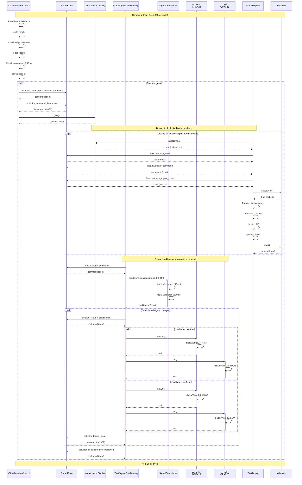

## 19. Signal Conditioning Detail Diagram

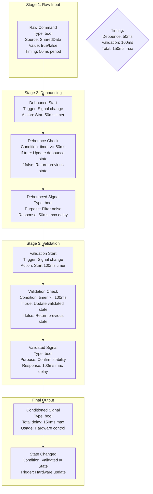

## 20. Input Methods Comparison Diagram

```mermaid
graph TB
    subgraph Methods["Input Methods"]
        Method1[Physical Button<br/>GPIO 18<br/>Type: Digital<br/>Features:<br/>- Edge detection<br/>- 250ms cooldown<br/>- Internal pull-up]
        
        Method2[Joystick Button<br/>GPIO 25<br/>Type: Digital<br/>Features:<br/>- Edge detection<br/>- 250ms cooldown<br/>- Internal pull-up]
        
        Method3[Serial Commands<br/>UART 115200<br/>Type: Text<br/>Commands:<br/>- on<br/>- off<br/>- toggle<br/>- status]
    end

    subgraph Processing["Common Processing"]
        EdgeDetect[Edge Detection<br/>Function: current && !last<br/>Detects new presses]
        
        CooldownCheck[Cooldown Check<br/>Function: now - last > 250ms<br/>Prevents double-click]
        
        SimpleDebounce[Simple Debounce<br/>Function: delayMs(50)<br/>Verifies button state]
        
        UpdateShared[Update SharedData<br/>Function: actuator_command = new<br/>Signal display task]
    end

    Method1 --> EdgeDetect
    Method2 --> EdgeDetect
    Method3 --> ParseSerial
    
    EdgeDetect --> CooldownCheck
    ParseSerial --> UpdateShared
    
    CooldownCheck --> SimpleDebounce
    SimpleDebounce --> UpdateShared

    note1{All methods<br/>update<br/>actuator_command}
```

## 21. State Machine Diagram

```mermaid
stateDiagram-v2
    [*] --> OFF: Initial state
    
    OFF --> TurningON: actuator_command == true
    
    TurningON --> DebouncingON: Start debounce<br/>(50ms timer)
    DebouncingON --> ValidatingON: Debounce elapsed<br/>Start validation<br/>(100ms timer)
    ValidatingON --> ON: Validation elapsed
    
    ON --> TurningOFF: actuator_command == false
    
    TurningOFF --> DebouncingOFF: Start debounce<br/>(50ms timer)
    DebouncingOFF --> ValidatingOFF: Debounce elapsed<br/>Start validation<br/>(100ms timer)
    ValidatingOFF --> OFF: Validation elapsed
    
    ON --> ON: Command unchanged<br/>Maintain state
    OFF --> OFF: Command unchanged<br/>Maintain state
    
    note right of TurningON: Hardware:<br/>Actuator: HIGH<br/>LED: HIGH
    
    note right of ON: Hardware:<br/>Actuator: HIGH<br/>LED: HIGH
    
    note right of TurningOFF: Hardware:<br/>Actuator: LOW<br/>LED: LOW
    
    note right of OFF: Hardware:<br/>Actuator: LOW<br/>LED: LOW
```

## 22. Timing Diagram

```mermaid
gantt
    title Actuator Control System Timing
    dateFormat X
    axisFormat %Lms

    section Input Processing
    Read Button      :active, 0, 5
    Edge Detection   :active, 5, 5
    Cooldown Check   :active, 10, 5
    Update Command   :active, 15, 5
    Signal Display   :crit, 20, 5

    section Signal Conditioning
    Read Command     :active, 0, 5
    Apply Debounce   :active, 5, 50
    Apply Validation :active, 55, 100
    Update Hardware  :crit, 155, 5

    section Display
    Wait Semaphore   :active, 20, 5
    Acquire Mutex    :active, 25, 5
    Update LCD       :crit, 30, 30
    Release Mutex    :active, 60, 5
```

## 23. Hardware Connection Diagram

```mermaid
graph LR
    subgraph ESP32["ESP32 Microcontroller"]
        GPIO18[GPIO 18<br/>Button Input<br/>Internal Pull-up]
        GPIO23[GPIO 23<br/>Actuator Output<br/>3.3V Logic]
        GPIO25[GPIO 25<br/>Joystick Button<br/>Internal Pull-up]
        GPIO34[GPIO 34<br/>Joystick X<br/>ADC Input]
        GPIO35[GPIO 35<br/>Joystick Y<br/>ADC Input]
        GPIO26[GPIO 26<br/>LED Output<br/>3.3V Logic]
        I2C21[GPIO 21<br/>I2C SDA<br/>LCD Data]
        I2C22[GPIO 22<br/>I2C SCL<br/>LCD Clock]
        UART0[UART0 TX/RX<br/>Serial<br/>115200 baud]
    end

    subgraph External["External Components"]
        BTN[Push Button<br/>Normally Open<br/>Connects to GND]
        
        RELAY[Relay Module<br/>SPDT<br/>Control: GPIO 23<br/>Load: 12V/24V]
        
        JS[Joystick<br/>X: ADC0<br/>Y: ADC1<br/>SW: GPIO]
        
        LEDRes[LED<br/>Red<br/>220Ω Resistor<br/>Connects to GND]
        
        LCDPCF[PCF8574<br/>I2C Expander<br/>Address: 0x27<br/>Controls: LCD]
        
        LCDHW[16x2 LCD<br/>HD44780<br/>VCC: 5V<br/>Contrast: Pot]
        
        USB[USB Cable<br/>Serial Monitor<br/>115200 baud]
    end

    BTN --> GPIO18
    GPIO23 --> RELAY
    GPIO25 --> JS
    GPIO34 --> JS
    GPIO35 --> JS
    GPIO26 --> LEDRes
    I2C21 --> LCDPCF
    I2C22 --> LCDPCF
    LCDPCF --> LCDHW
    UART0 --> USB

    note1{Power:<br/>ESP32: 5V USB<br/>Relay: 12V/24V External<br/>LCD: 5V External}
```

## 24. System Startup Sequence Diagram

```mermaid
sequenceDiagram
    participant Arduino as Arduino Framework
    participant Serial as Serial Port
    participant Act as Actuator
    participant JS as Joystick
    participant LED as Led
    participant SigCond as SignalConditioner
    participant LCD as LcdI2c
    participant FreeRTOS as FreeRTOS Kernel
    participant Task1 as vTaskActuatorControl
    participant Task2 as vTaskSignalConditioning
    participant Task3 as vTaskDisplay

    Note over Arduino,Task3: System Startup (setup())

    Arduino->>Serial: begin(115200)
    Serial-->>Arduino: initialized (bool)

    Arduino->>Arduino: delayMs(2000)
    Arduino-->>Arduino: elapsed (bool)

    Arduino->>Serial: print("=== LAB 4.1 ===")
    Serial-->>Arduino: written (int)

    Arduino->>Serial: print system info
    Serial-->>Arduino: written (int)

    Arduino->>Act: new Actuator(23)
    Act-->>Arduino: object (Actuator*)

    Arduino->>Act: begin()
    activate Act
    Act->>Act: pinMode(23, OUTPUT)
    Act->>Act: digitalWrite(23, LOW)
    Act-->>Arduino: void
    deactivate Act

    Arduino->>JS: new Joystick(34, 35, 25)
    JS-->>Arduino: object (Joystick*)

    Arduino->>JS: begin()
    activate JS
    JS->>JS: pinMode(25, INPUT_PULLUP)
    JS-->>Arduino: void
    deactivate JS

    Arduino->>LED: new Led(26)
    LED-->>Arduino: object (Led*)

    Arduino->>LED: begin()
    activate LED
    LED->>LED: pinMode(26, OUTPUT)
    LED->>LED: off()
    LED-->>Arduino: void
    deactivate LED

    Arduino->>SigCond: new SignalConditioner()
    SigCond-->>Arduino: object (SignalConditioner*)

    Arduino->>LCD: new LcdI2c(0x27, 16, 2)
    LCD-->>Arduino: object (LcdI2c*)

    Arduino->>LCD: begin()
    activate LCD
    LCD->>LCD: Wire.begin(21, 22)
    LCD->>LCD: initialize()
    LCD->>LCD: clear()
    LCD->>LCD: print("Actuator Control")
    LCD->>LCD: setCursor(0, 1)
    LCD->>LCD: print("System Ready")
    LCD-->>Arduino: void
    deactivate LCD

    Arduino->>Arduino: initSharedData()
    Arduino->>Arduino: initSyncPrimitives()

    Arduino->>FreeRTOS: createTask(vTaskActuatorControl)
    FreeRTOS-->>Arduino: handle (TaskHandle_t)

    Arduino->>FreeRTOS: createTask(vTaskSignalConditioning)
    FreeRTOS-->>Arduino: handle (TaskHandle_t)

    Arduino->>FreeRTOS: createTask(vTaskDisplay)
    FreeRTOS-->>Arduino: handle (TaskHandle_t)

    Arduino->>Serial: print("=== SCHEDULER STARTED ===")
    Serial-->>Arduino: written (int)

    Arduino->>FreeRTOS: vTaskStartScheduler()

    Note over FreeRTOS,Task3: FreeRTOS takes control

    par All tasks start
        FreeRTOS->>Task1: Start execution
        Task1-->>FreeRTOS: running
        
        FreeRTOS->>Task2: Start execution
        Task2-->>FreeRTOS: running
        
        FreeRTOS->>Task3: Start execution
        Task3-->>FreeRTOS: running
    end
```

## 25. Error Handling Flow Diagram

```mermaid
graph TB
    subgraph Errors["Potential Errors"]
        Err1[Button Bounce<br/>Type: Electrical noise<br/>Symptom: Multiple toggles<br/>Solution: 50ms debounce]
        
        Err2[Double Click<br/>Type: User error<br/>Symptom: Rapid toggles<br/>Solution: 250ms cooldown]
        
        Err3[Signal Noise<br/>Type: Interference<br/>Symptom: False triggers<br/>Solution: 100ms validation]
        
        Err4[Serial Overflow<br/>Type: Buffer overflow<br/>Symptom: Command lost<br/>Solution: 16 char buffer]
        
        Err5[LCD I2C Conflict<br/>Type: Concurrent access<br/>Symptom: Display corruption<br/>Solution: Mutex protection]
    end

    subgraph Handling["Error Handling"]
        Debounce[Debounce Stage<br/>Function: Filter rapid changes<br/>Time: 50ms<br/>Result: Stable signal]
        
        Cooldown[Cooldown Mechanism<br/>Function: Prevent rapid toggles<br/>Time: 250ms<br/>Result: Single toggle]
        
        Validation[Validation Stage<br/>Function: Confirm stability<br/>Time: 100ms<br/>Result: Verified state]
        
        Buffer[Serial Buffer<br/>Size: 16 characters<br/>Null-terminated<br/>Result: Safe parsing]
        
        Mutex[I2C Mutex<br/>Timeout: 100ms<br/>Priority: Display task<br/>Result: Exclusive access]
    end

    Err1 --> Debounce
    Err2 --> Cooldown
    Err3 --> Validation
    Err4 --> Buffer
    Err5 --> Mutex

    note1{Robust system<br/>with multiple<br/>protection layers}
```